# Class 7: Machine Learning 1
Zeyu Qi (A17342618)

- [Background](#background)
- [K-means clustering](#k-means-clustering)
- [Hierarchical Clustering](#hierarchical-clustering)
- [Principle Component Analysis
  (PCA)](#principle-component-analysis-pca)
  - [Analysis of UK food data](#analysis-of-uk-food-data)
- [Data import](#data-import)
- [Tidy the data](#tidy-the-data)
- [Exploratory analysis](#exploratory-analysis)
- [PCA](#pca)

## Background

Today we will explore some core machine learning methods that are very
popular in bioinformatics. These include **clustering** and
**dimensionallity reduction**.

## K-means clustering

The main function in “base” R for K-means clustering is called
`kmeans()`

Before we go too deep, let’s make up some “simple” data that we can
cluster and know if we are getting a good answer or not. To do this we
can use the `rnorm()`

``` r
hist(rnorm(1000, mean=3))
```

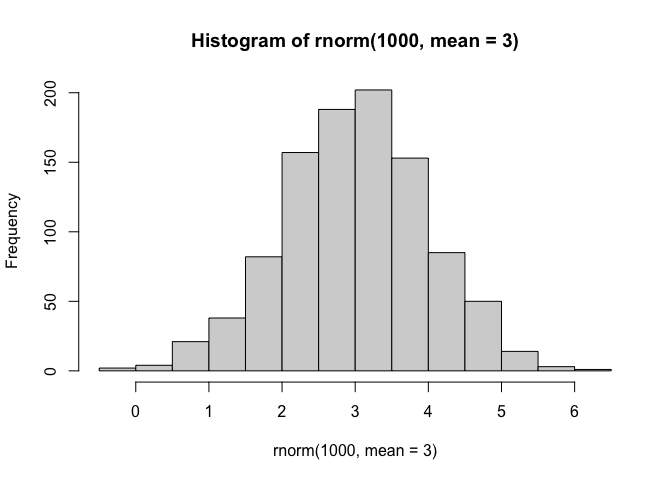

``` r
x <- c(rnorm(30, mean=-3), rnorm(30, mean=3))
z <- cbind(x, y=rev(x))
plot(z)
```

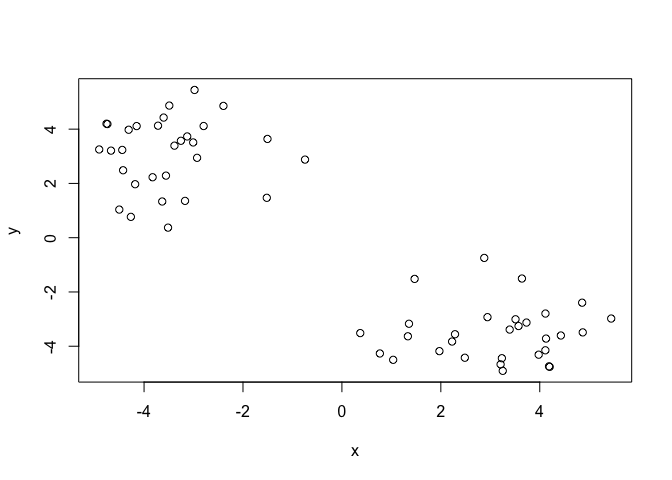

Now we can run `kmeans()` on this input `z` and see what the results
look like.

``` r
km <- kmeans(z, 2)
```

``` r
attributes(km)
```

    $names
    [1] "cluster"      "centers"      "totss"        "withinss"     "tot.withinss"
    [6] "betweenss"    "size"         "iter"         "ifault"      

    $class
    [1] "kmeans"

> Q. How many points are in each cluster?

``` r
km$size
```

    [1] 30 30

> Q. What component of your result object details cluster
> assignment/membership?

``` r
km$cluster
```

     [1] 2 2 2 2 2 2 2 2 2 2 2 2 2 2 2 2 2 2 2 2 2 2 2 2 2 2 2 2 2 2 1 1 1 1 1 1 1 1
    [39] 1 1 1 1 1 1 1 1 1 1 1 1 1 1 1 1 1 1 1 1 1 1

> Q. What component of your result object details cluster center?

``` r
km$centers
```

              x         y
    1  3.099454 -3.517008
    2 -3.517008  3.099454

> Q. Plot `z` colored by the kmeans cluster assignment and add cluster
> centers as blue points.

``` r
plot(z, col=c(km$cluster))
points(km$centers, col='blue', pch=15)
```

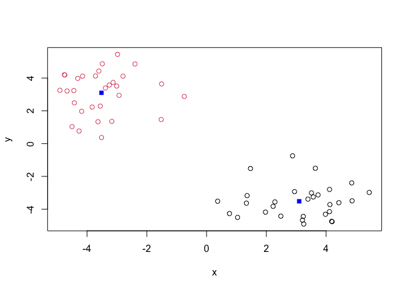

> Q. Run a Kmeans clustering and plot the results asking for 4 clusters.

``` r
km4 <- kmeans(z, 4)
plot(z, col=c(km4$cluster))
points(km4$centers, col='blue', pch=15)
```

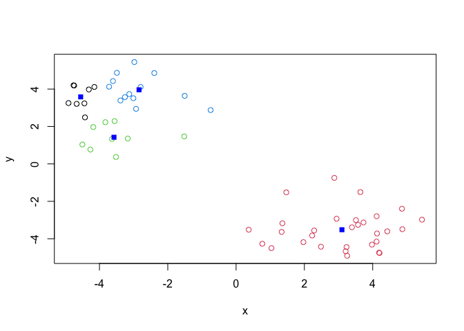

> **N.B.** You need to toll K-means the number of clusters (i.e. set
> `centers=2`)!!

One approach is to try different values for `centers` and then pick the
best…

``` r
ans <- NULL
for(i in 1:10) {
  km <- kmeans(z, i)
  ans <- c(ans, km$tot.withinss)
}
plot(ans, typ="o",
     xlab="Number of clusters",
     ylab="Total sum of squared distances")
```

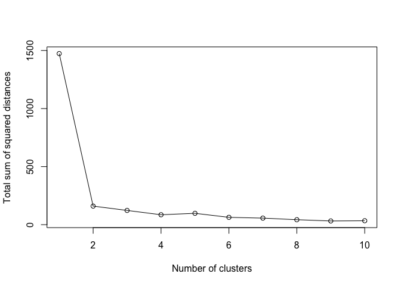

## Hierarchical Clustering

The main function in “base” R for Hierarchical Clustering is called
`hclust()`

This fucntion does not take your “raw” data fro clustering. You must
first build a “distance matrix” from your data and pass this as input to
`hclust()`

``` r
d <- dist(z)
hc <- hclust(d)
hc
```


    Call:
    hclust(d = d)

    Cluster method   : complete 
    Distance         : euclidean 
    Number of objects: 60 

There is a bespoke `plot()` method for `hclust()` result objects.

``` r
plot(hc)
abline(h=8, col="red")
```

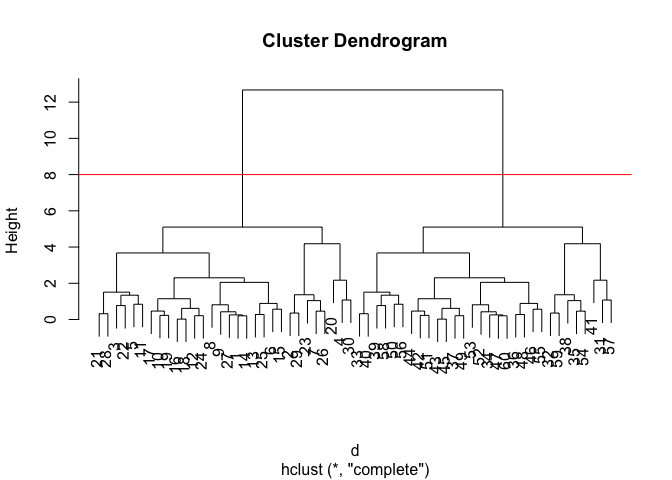

Once we have our `hclust` object (tree of cluster dendrogram), we can
*“cut”* the tree to reval the clustering pattern.

``` r
cutree(hc, h=4)
```

     [1] 1 2 1 3 1 1 2 1 1 1 1 1 1 1 1 1 1 1 1 3 1 1 2 1 1 2 1 1 2 3 4 5 6 6 5 6 6 5
    [39] 6 6 4 6 6 6 6 6 6 6 6 6 6 6 6 5 6 6 4 6 5 6

> Q. Make a plot of `z` with your hclust results (i.e. colored by
> cluster membership).

``` r
grps <- cutree(hc, k=2)
plot(z, col=c(grps))
```

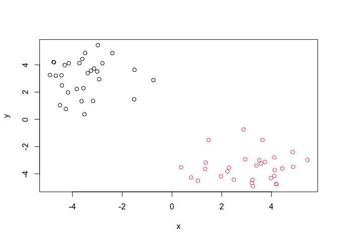

## Principle Component Analysis (PCA)

PCA is a dimensionallity reduction method that is popular for revealing
pattern in complex datasets.

### Analysis of UK food data

Let’s look at some data on the eating habits of folks from the UK to see
if there are pattern and trends that have some regions being distinct
from others.

## Data import

The data is made avaliable in CSV format

``` r
url <- "https://tinyurl.com/UK-foods"
x <- read.csv(url)
```

> Q1. How many rows and columns are in your new data frame named x? What
> R functions could you use to answer this questions?

``` r
dim(x)
```

    [1] 17  5

## Tidy the data

Fix anything that went wrong with data import

``` r
x <- read.csv(url, row.names=1)
head(x)
```

                   England Wales Scotland N.Ireland
    Cheese             105   103      103        66
    Carcass_meat       245   227      242       267
    Other_meat         685   803      750       586
    Fish               147   160      122        93
    Fats_and_oils      193   235      184       209
    Sugars             156   175      147       139

> Q2. Which approach to solving the ‘row-names problem’ mentioned above
> do you prefer and why? Is one approach more robust than another under
> certain circumstances?

I prefer using `row.names=1` because `x <- x[,-1]` will cause problems
if you run multiple times.

## Exploratory analysis

Make some plots to help make sense of obvious trends…

``` r
barplot(as.matrix(x), beside=T, col=rainbow(nrow(x)))
```

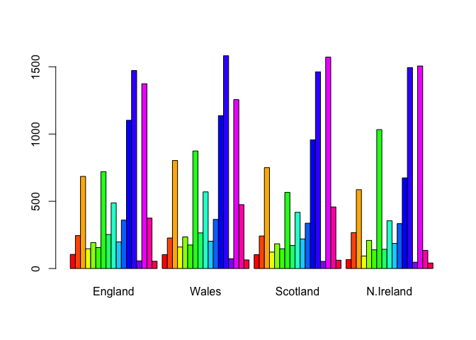

> Q3: Changing what optional argument in the above barplot() function
> results in the following plot?

Changing `beside=FALSE`

``` r
barplot(as.matrix(x), beside=F, col=rainbow(nrow(x)))
```


> Q4: Changing what optional argument in the above ggplot() code results
> in a stacked barplot figure?

We can use `geom_col()` function to create a stacked bar chart where
values are accumulated vertically

> Q5: We can use the pairs() function to generate all pairwise plots for
> our countries. Can you make sense of the following code and resulting
> figure? What does it mean if a given point lies on the diagonal for a
> given plot?

``` r
pairs(x, col=rainbow(nrow(x)), pch=16)
```


The `pairs()` function creates a scatterplot matrix, showing all
pairwise relationships between the variables. Each small panel is a
scatterplot comparing one country (x-axis) vs another (y-axis). If a
given point lies on the diagonal for a given plot, it means that the two
variables have equal values for that observation

``` r
library(pheatmap)

pheatmap( as.matrix(x) )
```


> Q6. Based on the pairs and heatmap figures, which countries cluster
> together and what does this suggest about their food consumption
> patterns? Can you easily tell what the main differences between N.
> Ireland and the other countries of the UK in terms of this data-set?

England and Wales cluster most closely together, with Scotland joining
them next, while Northern Ireland is the most distinct. This suggests
England and Wales have very similar food consumption patterns, Scotland
is somewhat similar, and Northern Ireland differs more. But the exact
main differences aren’t immediately obvious without deeper analysis.

## PCA

The main function in “base” R for PCA is called `prcomp()`. This
function expects the observations to be rows and the variables to be
columns.

So here we need to take transpose of our `x` input object

``` r
pca<- prcomp(t(x))
summary(pca)
```

    Importance of components:
                                PC1      PC2      PC3       PC4
    Standard deviation     324.1502 212.7478 73.87622 2.921e-14
    Proportion of Variance   0.6744   0.2905  0.03503 0.000e+00
    Cumulative Proportion    0.6744   0.9650  1.00000 1.000e+00

The returned `pca` object has components that we can use to make our
main result figures:

``` r
attributes(pca)
```

    $names
    [1] "sdev"     "rotation" "center"   "scale"    "x"       

    $class
    [1] "prcomp"

The main result figure from this analysis is called a “PC score plot” or
“ordenation plot” “PC plot” or “PC1 vs PC2 plot”.

This plot shows how samples (in this case countries) relate to each
other along our new PC axis.

This is our new “reduced-dimensional space”. In this case 2 dimensions,
PC1 and PC2, that capture most of the variance in the dataset.

> Q7. Complete the code below to generate a plot of PC1 vs PC2. The
> second line adds text labels over the data points.

``` r
library(ggplot2)
ggplot(pca$x) +
  aes(PC1, PC2) +
  geom_point()
```

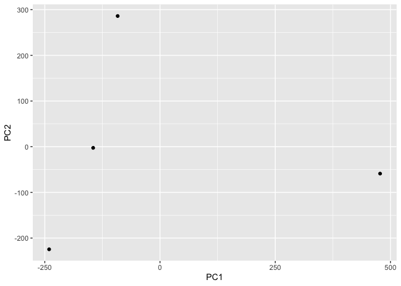

``` r
mycols <- c("orange", "red", "blue", "darkgreen")

ggplot(pca$x) +
  aes(PC1, PC2) +
  geom_point(col=mycols)
```

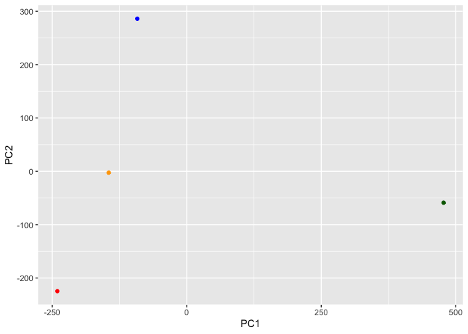

> Q8. Customize your plot so that the colors of the country names match
> the colors in our UK and Ireland map and table at start of this
> document.

``` r
ggplot(pca$x) +
  aes(PC1, PC2, label=row.names(pca$x)) +
  geom_point(col=mycols) +
  geom_text(size=3, vjust=2, col=mycols)
```

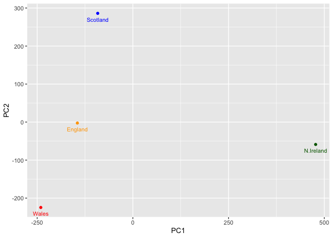

> Q9: Generate a similar ‘loadings plot’ for PC2. What two food groups
> feature prominantely and what does PC2 maninly tell us about?

``` r
ggplot(pca$rotation) +
  aes(PC1, row.names(pca$rotation)) +
  geom_col()
```


``` r
ggplot(pca$rotation) +
  aes(x = PC1, 
      y = reorder(rownames(pca$rotation), PC1)) +
  geom_col(fill = "steelblue") +
  xlab("PC1 Loading Score") +
  ylab("") +
  theme_bw() +
  theme(axis.text.y = element_text(size = 9))
```

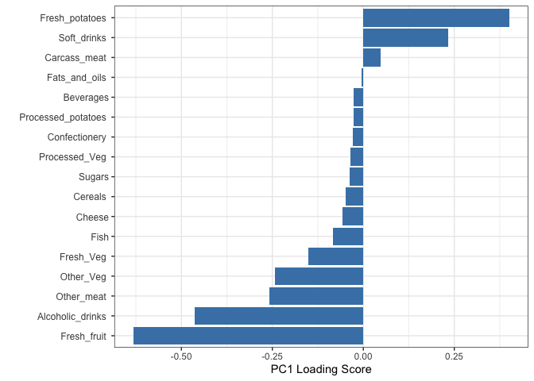
