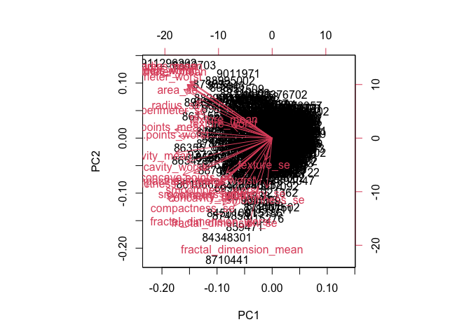
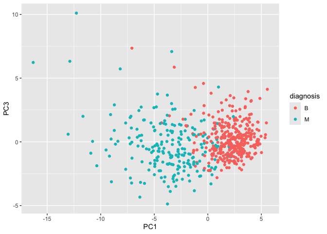
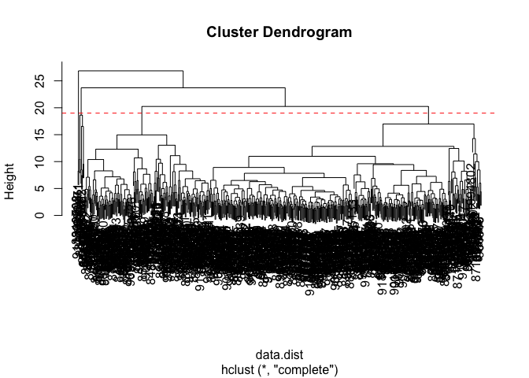
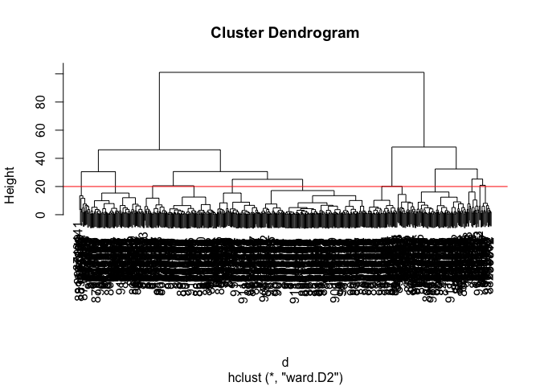

# Class 08: Breast Cancer Mini Project
Zeyu Qi (A17342618)

- [Background](#background)
- [Data Import](#data-import)
- [Exploratory Data Analysis](#exploratory-data-analysis)
- [Hierarchical clustering](#hierarchical-clustering)
- [Combining methods](#combining-methods)

## Background

The goal of this mini-project is for you to explore a complete analysis
using the unsupervised learning techniques covered in class.

Today we will analyze a data-set from a fine needle aspiration (FNA) of
a breast mass.

## Data Import

The data is made available as a CSV file for download. We can read this
in using `read.csv()`.

``` r
# Save your input data file into your Project directory
fna.data <- "WisconsinCancer.csv"

# Complete the following code to input the data and store as wisc.df
wisc.df <- read.csv(fna.data, row.names=1)

head(wisc.df)
```

             diagnosis radius_mean texture_mean perimeter_mean area_mean
    842302           M       17.99        10.38         122.80    1001.0
    842517           M       20.57        17.77         132.90    1326.0
    84300903         M       19.69        21.25         130.00    1203.0
    84348301         M       11.42        20.38          77.58     386.1
    84358402         M       20.29        14.34         135.10    1297.0
    843786           M       12.45        15.70          82.57     477.1
             smoothness_mean compactness_mean concavity_mean concave.points_mean
    842302           0.11840          0.27760         0.3001             0.14710
    842517           0.08474          0.07864         0.0869             0.07017
    84300903         0.10960          0.15990         0.1974             0.12790
    84348301         0.14250          0.28390         0.2414             0.10520
    84358402         0.10030          0.13280         0.1980             0.10430
    843786           0.12780          0.17000         0.1578             0.08089
             symmetry_mean fractal_dimension_mean radius_se texture_se perimeter_se
    842302          0.2419                0.07871    1.0950     0.9053        8.589
    842517          0.1812                0.05667    0.5435     0.7339        3.398
    84300903        0.2069                0.05999    0.7456     0.7869        4.585
    84348301        0.2597                0.09744    0.4956     1.1560        3.445
    84358402        0.1809                0.05883    0.7572     0.7813        5.438
    843786          0.2087                0.07613    0.3345     0.8902        2.217
             area_se smoothness_se compactness_se concavity_se concave.points_se
    842302    153.40      0.006399        0.04904      0.05373           0.01587
    842517     74.08      0.005225        0.01308      0.01860           0.01340
    84300903   94.03      0.006150        0.04006      0.03832           0.02058
    84348301   27.23      0.009110        0.07458      0.05661           0.01867
    84358402   94.44      0.011490        0.02461      0.05688           0.01885
    843786     27.19      0.007510        0.03345      0.03672           0.01137
             symmetry_se fractal_dimension_se radius_worst texture_worst
    842302       0.03003             0.006193        25.38         17.33
    842517       0.01389             0.003532        24.99         23.41
    84300903     0.02250             0.004571        23.57         25.53
    84348301     0.05963             0.009208        14.91         26.50
    84358402     0.01756             0.005115        22.54         16.67
    843786       0.02165             0.005082        15.47         23.75
             perimeter_worst area_worst smoothness_worst compactness_worst
    842302            184.60     2019.0           0.1622            0.6656
    842517            158.80     1956.0           0.1238            0.1866
    84300903          152.50     1709.0           0.1444            0.4245
    84348301           98.87      567.7           0.2098            0.8663
    84358402          152.20     1575.0           0.1374            0.2050
    843786            103.40      741.6           0.1791            0.5249
             concavity_worst concave.points_worst symmetry_worst
    842302            0.7119               0.2654         0.4601
    842517            0.2416               0.1860         0.2750
    84300903          0.4504               0.2430         0.3613
    84348301          0.6869               0.2575         0.6638
    84358402          0.4000               0.1625         0.2364
    843786            0.5355               0.1741         0.3985
             fractal_dimension_worst
    842302                   0.11890
    842517                   0.08902
    84300903                 0.08758
    84348301                 0.17300
    84358402                 0.07678
    843786                   0.12440

Make sure we remove or exclude `diagnosis` column from the data-set that
we use for further analysis - this is the expert diagnosis as either M
or B:

``` r
# We can use -1 here to remove the first column
wisc.data <- wisc.df[,-1]
diagnosis <- as.factor(wisc.df$diagnosis)
```

## Exploratory Data Analysis

> Q1. How many observations are in this dataset?

``` r
nrow(wisc.data)
```

    [1] 569

> Q2. How many of the observations have a malignant diagnosis?

``` r
table(wisc.df$diagnosis)
```


      B   M 
    357 212 

> Q3. How many variables/features in the data are suffixed with \_mean?

We can use `grep()` function to help us here:

``` r
length(grep("_mean", colnames(wisc.data)))
```

    [1] 10

\## Principal Component Analysis (PCA)

We need to scale our data before PCA with the `scale=TRUE` argument to
`prcomp()`

``` r
wisc.pr <- prcomp(wisc.data, scale=TRUE)
summary(wisc.pr)
```

    Importance of components:
                              PC1    PC2     PC3     PC4     PC5     PC6     PC7
    Standard deviation     3.6444 2.3857 1.67867 1.40735 1.28403 1.09880 0.82172
    Proportion of Variance 0.4427 0.1897 0.09393 0.06602 0.05496 0.04025 0.02251
    Cumulative Proportion  0.4427 0.6324 0.72636 0.79239 0.84734 0.88759 0.91010
                               PC8    PC9    PC10   PC11    PC12    PC13    PC14
    Standard deviation     0.69037 0.6457 0.59219 0.5421 0.51104 0.49128 0.39624
    Proportion of Variance 0.01589 0.0139 0.01169 0.0098 0.00871 0.00805 0.00523
    Cumulative Proportion  0.92598 0.9399 0.95157 0.9614 0.97007 0.97812 0.98335
                              PC15    PC16    PC17    PC18    PC19    PC20   PC21
    Standard deviation     0.30681 0.28260 0.24372 0.22939 0.22244 0.17652 0.1731
    Proportion of Variance 0.00314 0.00266 0.00198 0.00175 0.00165 0.00104 0.0010
    Cumulative Proportion  0.98649 0.98915 0.99113 0.99288 0.99453 0.99557 0.9966
                              PC22    PC23   PC24    PC25    PC26    PC27    PC28
    Standard deviation     0.16565 0.15602 0.1344 0.12442 0.09043 0.08307 0.03987
    Proportion of Variance 0.00091 0.00081 0.0006 0.00052 0.00027 0.00023 0.00005
    Cumulative Proportion  0.99749 0.99830 0.9989 0.99942 0.99969 0.99992 0.99997
                              PC29    PC30
    Standard deviation     0.02736 0.01153
    Proportion of Variance 0.00002 0.00000
    Cumulative Proportion  1.00000 1.00000

> Q4. From your results, what proportion of the original variance is
> captured by the first principal component (PC1)?

``` r
summary(wisc.pr)$importance[2, 1]
```

    [1] 0.44272

> Q5. How many principal components (PCs) are required to describe at
> least 70% of the original variance in the data?

``` r
which(summary(wisc.pr)$importance[3, ] >= 0.70)[1]
```

    PC3 
      3 

> Q6. How many principal components (PCs) are required to describe at
> least 90% of the original variance in the data?

``` r
which(summary(wisc.pr)$importance[3, ] >= 0.90)[1]
```

    PC7 
      7 

> Q7. What stands out to you about this plot? Is it easy or difficult to
> understand? Why?

``` r
biplot(wisc.pr)
```



It is difficult to understand because all points are plotted together
with different categorical names labeled.

> Q8. Generate a similar plot for principal components 1 and 3. What do
> you notice about these plots?

B and M seems to be seperated.

Let’s see the “PC score plot”

``` r
library(ggplot2)

ggplot(wisc.pr$x) +
  aes(PC1, PC3, col=diagnosis) +
  geom_point()
```



> Q9. For the first principal component, what is the component of the
> loading vector (i.e. wisc.pr\$rotation\[,1\]) for the feature
> concave.points_mean? This tells us how much this original feature
> contributes to the first PC. Are there any features with larger
> contributions than this one?

For the first principal component (PC1) in the Wisconsin breast cancer
dataset, the loading for concave.points_mean is large and positive.This
means it is one of the strongest contributors to PC1. There may be a few
features with similar or slightly larger loadings but overall
concave.points_mean is among the top contributors to the first principal
component.

## Hierarchical clustering

``` r
# Scale the wisc.data data using the "scale()" function
data.scaled <- scale(wisc.data)
data.dist <- dist(data.scaled)
wisc.hclust <- hclust(data.dist, method="complete")
```

``` r
plot(wisc.hclust)
abline(h=19, col="red", lty=2)
```



> Q10. Using the plot() and abline() functions, what is the height at
> which the clustering model has 4 clusters?

h=20

## Combining methods

> Q12. Which method gives your favorite results for the same data.dist
> dataset? Explain your reasoning.

Ward.D2 gives the best results.

It tends to produce compact, well-separated clusters because it
minimizes within-cluster variance at each step. In contrast, single
linkage often creates “chaining” effects, and complete/average linkage
can be less balanced. Overall, Ward.D2 usually yields the most
interpretable and meaningful clustering structure for this dataset.

``` r
d <- dist(wisc.pr$x[,1:4])
wisc.pr.hclust <- hclust(d, method="ward.D2")
plot(wisc.pr.hclust)
abline(h=20, col="red")
```



``` r
grps <- cutree(wisc.pr.hclust, h=70)
table(grps)
```

    grps
      1   2 
    171 398 

> Q13. How well does the newly created hclust model with two clusters
> separate out the two “M” and “B” diagnoses?

How does this clustering `grps` correspond to the expert `diagnosis`?

``` r
table(diagnosis, grps)
```

             grps
    diagnosis   1   2
            B   6 351
            M 165  47

The clustering corresponds fairly well to the expert diagnosis. Group 1
is mostly malignant: 165 M and only 6 B. Group 2 is mostly benign: 351 B
and 47 M. So the clusters separate benign and malignant cases pretty
well, though not perfectly because 53 total cases are placed in the
opposite-majority cluster.

> Q14. How well do the hierarchical clustering models you created in the
> previous sections (i.e. without first doing PCA) do in terms of
> separating the diagnoses? Again, use the table() function to compare
> the output of each model (wisc.hclust.clusters and
> wisc.pr.hclust.clusters) with the vector containing the actual
> diagnoses.

``` r
wisc.hclust.clusters <- cutree(wisc.hclust, k = 4)
table(wisc.hclust.clusters, diagnosis)
```

                        diagnosis
    wisc.hclust.clusters   B   M
                       1  12 165
                       2   2   5
                       3 343  40
                       4   0   2

The hierarchical clustering without PCA does a poorer job separating the
diagnoses. The clusters contain a more mixed combination of benign and
malignant cases, indicating less clear structure in the data. Overall,
compared to the PCA-based clustering, it is less effective at
distinguishing between the two groups.

> Q16. Which of these new patients should we prioritize for follow up
> based on your results?

We should prioritize patient 2 for follow-up.

From the PCA plot, patient 2 lies closer to the cluster associated with
malignant (M) cases, while patient 1 is closer to the benign cluster.
This suggests patient 2 is at higher risk and should be examined more
urgently.
