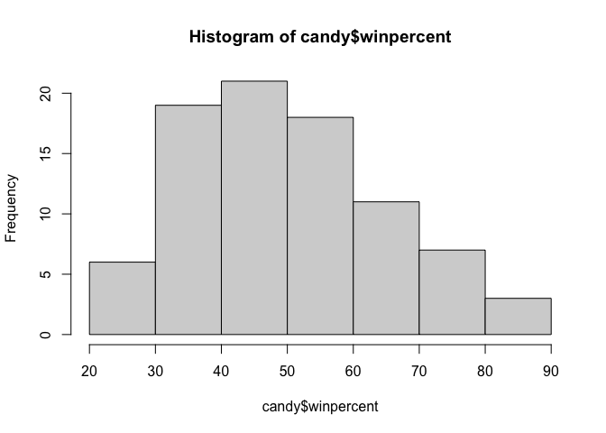
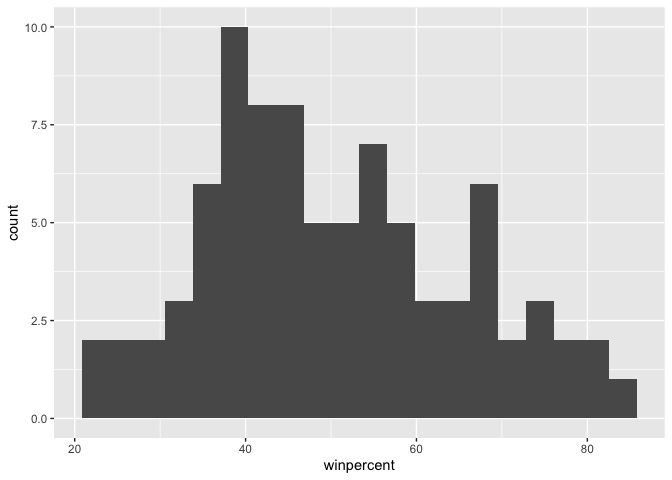
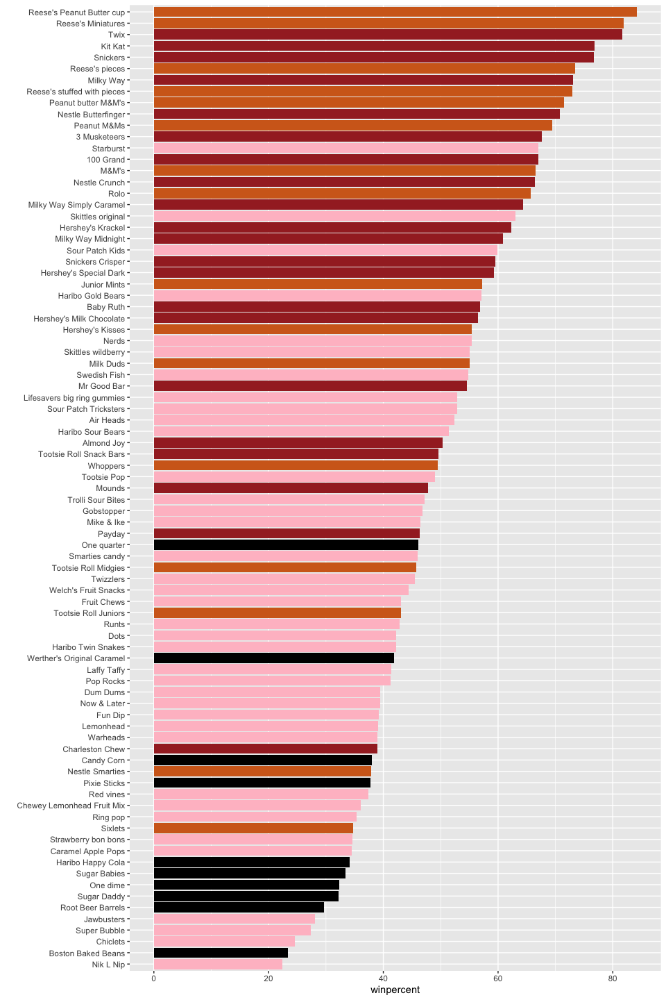
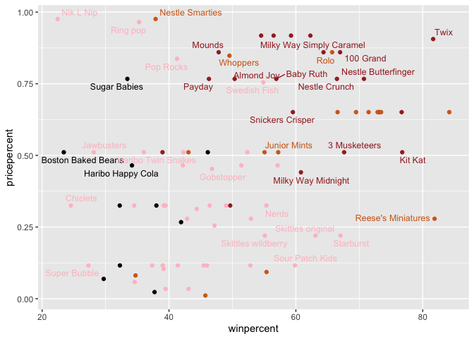
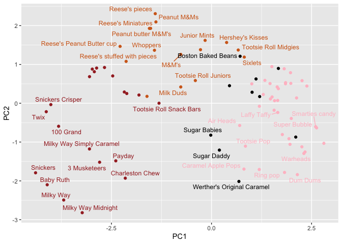
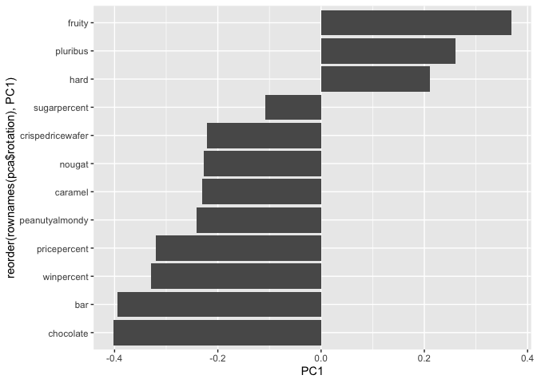

# Class 09: Candy Mini-Project
Zeyu Qi(A17342618)

- [Background](#background)
- [Data Import](#data-import)
- [Exploratory analysis](#exploratory-analysis)
- [Overall Candy Rankings](#overall-candy-rankings)
- [Taking a look at pricepercent](#taking-a-look-at-pricepercent)
- [Exploring the correlation
  structure](#exploring-the-correlation-structure)
- [Principal Component Analysis](#principal-component-analysis)
- [Summary](#summary)

## Background

Today we are taking a small detor to analyze a dataset (that we have
more intrinsic insight into) with the most useful analysis method we
have learned thus far - Principal Component Analysis (PCA)

## Data Import

The data is all related to halloween candy and is from the 538 website.

``` r
candy_file <- "candy-data.csv"

candy = read.csv(candy_file, row.names=1)
head(candy)
```

                 chocolate fruity caramel peanutyalmondy nougat crispedricewafer
    100 Grand            1      0       1              0      0                1
    3 Musketeers         1      0       0              0      1                0
    One dime             0      0       0              0      0                0
    One quarter          0      0       0              0      0                0
    Air Heads            0      1       0              0      0                0
    Almond Joy           1      0       0              1      0                0
                 hard bar pluribus sugarpercent pricepercent winpercent
    100 Grand       0   1        0        0.732        0.860   66.97173
    3 Musketeers    0   1        0        0.604        0.511   67.60294
    One dime        0   0        0        0.011        0.116   32.26109
    One quarter     0   0        0        0.011        0.511   46.11650
    Air Heads       0   0        0        0.906        0.511   52.34146
    Almond Joy      0   1        0        0.465        0.767   50.34755

> Q1. How many different candy types are in this dataset?

``` r
nrow(candy)
```

    [1] 85

> Q2. How many fruity candy types are in the dataset?

``` r
sum(candy$fruity == 1)
```

    [1] 38

> Q3. What is your favorite candy (other than Twix) in the dataset and
> what is it’s winpercent value?

``` r
candy["Nerds", ]$winpercent
```

    [1] 55.35405

> Q4. What is the winpercent value for “Kit Kat”?

``` r
candy["Kit Kat", ]$winpercent
```

    [1] 76.7686

> Q5. What is the winpercent value for “Tootsie Roll Snack Bars”?

``` r
candy["Tootsie Roll Snack Bars", ]$winpercent
```

    [1] 49.6535

There is a useful `skim()` function in the **skimr** package that can
help give you a quick overview of a given dataset. Let’s install this
package and try it on our candy data.

``` r
# install.packages("skimr")
skimr::skim(candy)
```

|                                                  |       |
|:-------------------------------------------------|:------|
| Name                                             | candy |
| Number of rows                                   | 85    |
| Number of columns                                | 12    |
| \_\_\_\_\_\_\_\_\_\_\_\_\_\_\_\_\_\_\_\_\_\_\_   |       |
| Column type frequency:                           |       |
| numeric                                          | 12    |
| \_\_\_\_\_\_\_\_\_\_\_\_\_\_\_\_\_\_\_\_\_\_\_\_ |       |
| Group variables                                  | None  |

Data summary

**Variable type: numeric**

| skim_variable | n_missing | complete_rate | mean | sd | p0 | p25 | p50 | p75 | p100 | hist |
|:---|---:|---:|---:|---:|---:|---:|---:|---:|---:|:---|
| chocolate | 0 | 1 | 0.44 | 0.50 | 0.00 | 0.00 | 0.00 | 1.00 | 1.00 | ▇▁▁▁▆ |
| fruity | 0 | 1 | 0.45 | 0.50 | 0.00 | 0.00 | 0.00 | 1.00 | 1.00 | ▇▁▁▁▆ |
| caramel | 0 | 1 | 0.16 | 0.37 | 0.00 | 0.00 | 0.00 | 0.00 | 1.00 | ▇▁▁▁▂ |
| peanutyalmondy | 0 | 1 | 0.16 | 0.37 | 0.00 | 0.00 | 0.00 | 0.00 | 1.00 | ▇▁▁▁▂ |
| nougat | 0 | 1 | 0.08 | 0.28 | 0.00 | 0.00 | 0.00 | 0.00 | 1.00 | ▇▁▁▁▁ |
| crispedricewafer | 0 | 1 | 0.08 | 0.28 | 0.00 | 0.00 | 0.00 | 0.00 | 1.00 | ▇▁▁▁▁ |
| hard | 0 | 1 | 0.18 | 0.38 | 0.00 | 0.00 | 0.00 | 0.00 | 1.00 | ▇▁▁▁▂ |
| bar | 0 | 1 | 0.25 | 0.43 | 0.00 | 0.00 | 0.00 | 0.00 | 1.00 | ▇▁▁▁▂ |
| pluribus | 0 | 1 | 0.52 | 0.50 | 0.00 | 0.00 | 1.00 | 1.00 | 1.00 | ▇▁▁▁▇ |
| sugarpercent | 0 | 1 | 0.48 | 0.28 | 0.01 | 0.22 | 0.47 | 0.73 | 0.99 | ▇▇▇▇▆ |
| pricepercent | 0 | 1 | 0.47 | 0.29 | 0.01 | 0.26 | 0.47 | 0.65 | 0.98 | ▇▇▇▇▆ |
| winpercent | 0 | 1 | 50.32 | 14.71 | 22.45 | 39.14 | 47.83 | 59.86 | 84.18 | ▃▇▆▅▂ |

> Q6. Is there any variable/column that looks to be on a different scale
> to the majority of the other columns in the dataset?

Yes. Most columns are on a 0/1 binary scale. Sugarpercent, pricepercent,
and winpercent are on different scales. Winpercent looks especially
different because it is a percentage-like variable.

> Q7. What do you think a zero and one represent for the
> candy\$chocolate column?

For candy\$chocolate: 0 = a candy is not chocolate and 1 = a candy is
chocolate.

## Exploratory analysis

> Q8. Plot a histogram of winpercent values using both base R and
> ggplot2.

``` r
hist(candy$winpercent)
```



``` r
library(ggplot2)

ggplot(candy) +
  aes(winpercent) +
  geom_histogram(bins=20)
```



> Q9. Is the distribution of winpercent values symmetrical?

The distribution is not symmetrical.

> Q10. Is the center of the distribution above or below 50%?

``` r
mean(candy$winpercent)
```

    [1] 50.31676

``` r
median(candy$winpercent)
```

    [1] 47.82975

> Q11. On average is chocolate candy higher or lower ranked than fruit
> candy?

``` r
mean(candy$winpercent[candy$chocolate == 1])
```

    [1] 60.92153

``` r
mean(candy$winpercent[candy$fruity == 1])
```

    [1] 44.11974

On average, chocolate candy is higher ranked than fruit candy.

> Q12. Is this difference statistically significant?

``` r
t.test(
  candy$winpercent[candy$chocolate == 1],
  candy$winpercent[candy$fruity == 1]
)
```


        Welch Two Sample t-test

    data:  candy$winpercent[candy$chocolate == 1] and candy$winpercent[candy$fruity == 1]
    t = 6.2582, df = 68.882, p-value = 2.871e-08
    alternative hypothesis: true difference in means is not equal to 0
    95 percent confidence interval:
     11.44563 22.15795
    sample estimates:
    mean of x mean of y 
     60.92153  44.11974 

The p-value from the Welch Two Sample t-test is 2.871e-08. Since this is
much smaller than 0.05, the difference is statistically significant.

## Overall Candy Rankings

> Q13. What are the five least liked candy types in this set?

``` r
head(candy[order(candy$sugarpercent, decreasing=TRUE),], n=5)
```

                                chocolate fruity caramel peanutyalmondy nougat
    Reese's stuffed with pieces         1      0       0              1      0
    Milky Way Simply Caramel            1      0       1              0      0
    Sugar Babies                        0      0       1              0      0
    Skittles original                   0      1       0              0      0
    Skittles wildberry                  0      1       0              0      0
                                crispedricewafer hard bar pluribus sugarpercent
    Reese's stuffed with pieces                0    0   0        0        0.988
    Milky Way Simply Caramel                   0    0   1        0        0.965
    Sugar Babies                               0    0   0        1        0.965
    Skittles original                          0    0   0        1        0.941
    Skittles wildberry                         0    0   0        1        0.941
                                pricepercent winpercent
    Reese's stuffed with pieces        0.651   72.88790
    Milky Way Simply Caramel           0.860   64.35334
    Sugar Babies                       0.767   33.43755
    Skittles original                  0.220   63.08514
    Skittles wildberry                 0.220   55.10370

> Q14. What are the top 5 all time favorite candy types out of this set?

``` r
head(candy[order(candy$sugarpercent),], n=5)
```

                       chocolate fruity caramel peanutyalmondy nougat
    One dime                   0      0       0              0      0
    One quarter                0      0       0              0      0
    Reese's Miniatures         1      0       0              1      0
    Chiclets                   0      1       0              0      0
    Lemonhead                  0      1       0              0      0
                       crispedricewafer hard bar pluribus sugarpercent pricepercent
    One dime                          0    0   0        0        0.011        0.116
    One quarter                       0    0   0        0        0.011        0.511
    Reese's Miniatures                0    0   0        0        0.034        0.279
    Chiclets                          0    0   0        1        0.046        0.325
    Lemonhead                         0    1   0        0        0.046        0.104
                       winpercent
    One dime             32.26109
    One quarter          46.11650
    Reese's Miniatures   81.86626
    Chiclets             24.52499
    Lemonhead            39.14106

> Q15. Make a first barplot of candy ranking based on winpercent values.

``` r
ggplot(candy) + 
  aes(winpercent, rownames(candy)) +
  geom_col()
```


> Q16. This is quite ugly, use the reorder() function to get the bars
> sorted by winpercent?

``` r
ggplot(candy) + 
  aes(winpercent, reorder(rownames(candy),winpercent)) +
  geom_col()
```


> Q17. What is the worst ranked chocolate candy?

``` r
my_cols=rep("black", nrow(candy))
my_cols[as.logical(candy$chocolate)] = "chocolate"
my_cols[as.logical(candy$bar)] = "brown"
my_cols[as.logical(candy$fruity)] = "pink"


ggplot(candy) + 
  aes(winpercent, reorder(rownames(candy),winpercent)) +
  geom_col(fill=my_cols) +
  ylab("")
```



The worst ranked chocolate candy is Sixlets.

> Q18. What is the best ranked fruity candy?

The best ranked fruity candy is Starburst.

## Taking a look at pricepercent

We can fix the label text overplotting with an add on package called
`ggrepel` and it’s `geom_text_repel`.

``` r
# install.packages("ggrepel")
library(ggrepel)

# How about a plot of win vs price
ggplot(candy) +
  aes(x=winpercent, y=pricepercent, label=rownames(candy)) +
  geom_point(col=my_cols) + 
  geom_text_repel(col=my_cols, size=3.3, max.overlaps = 5)
```



> Q19. Which candy type is the highest ranked in terms of winpercent for
> the least money - i.e. offers the most bang for your buck?

``` r
ord <- order(candy$pricepercent, decreasing = FALSE)
head( candy[ord,c(11,12)], n=5 )
```

                         pricepercent winpercent
    Tootsie Roll Midgies        0.011   45.73675
    Pixie Sticks                0.023   37.72234
    Dum Dums                    0.034   39.46056
    Fruit Chews                 0.034   43.08892
    Strawberry bon bons         0.058   34.57899

> Q20. What are the top 5 most expensive candy types in the dataset and
> of these which is the least popular?

``` r
ord <- order(candy$pricepercent, decreasing = TRUE)
head( candy[ord,c(11,12)], n=5 )
```

                             pricepercent winpercent
    Nik L Nip                       0.976   22.44534
    Nestle Smarties                 0.976   37.88719
    Ring pop                        0.965   35.29076
    Hershey's Krackel               0.918   62.28448
    Hershey's Milk Chocolate        0.918   56.49050

## Exploring the correlation structure

``` r
# install.packages("corrplot")
library(corrplot)
```

    corrplot 0.95 loaded

``` r
cij <- cor(candy)
corrplot(cij)
```


> Q22. Examining this plot what two variables are anti-correlated
> (i.e. have minus values)?

Fruity and chocolate.

> Q23. Use your corrplot result to make a prediction: which variables do
> you expect will have the largest contributions (i.e. loadings) to PC1
> (i.e., drive the most separation between candies along the first
> principal component)?

Fruity and chocolate might have the largest contributions
(i.e. loadings) to PC1.

## Principal Component Analysis

In this case we want to be sure the set `scale=TRUE` because we have one
variable `winpercent` that is on a very different scale than all others
and would otherwise dominate PCA results.

``` r
pca <- prcomp(candy, scale=TRUE)
summary(pca)
```

    Importance of components:
                              PC1    PC2    PC3     PC4    PC5     PC6     PC7
    Standard deviation     2.0788 1.1378 1.1092 1.07533 0.9518 0.81923 0.81530
    Proportion of Variance 0.3601 0.1079 0.1025 0.09636 0.0755 0.05593 0.05539
    Cumulative Proportion  0.3601 0.4680 0.5705 0.66688 0.7424 0.79830 0.85369
                               PC8     PC9    PC10    PC11    PC12
    Standard deviation     0.74530 0.67824 0.62349 0.43974 0.39760
    Proportion of Variance 0.04629 0.03833 0.03239 0.01611 0.01317
    Cumulative Proportion  0.89998 0.93832 0.97071 0.98683 1.00000

The first major result figure is the “score plot” of PC1 vs PC2 - how
different candy are related to each other on our new PC axis:

``` r
ggplot(pca$x) +
  aes(PC1, PC2, label=row.names(pca$x)) +
  geom_point(col=my_cols) +
  geom_text_repel(col=my_cols, size=3.3, max.overlaps = 5)
```



> Q24. Complete the code to generate the loadings plot above. What
> original variables are picked up strongly by PC1 in the positive
> direction? Do these make sense to you? Where did you see this
> relationship highlighted previously?

``` r
ggplot(pca$rotation) +
  aes(PC1, reorder(rownames(pca$rotation), PC1)) +
  geom_col()
```



## Summary

> Q25. Based on your exploratory analysis, correlation findings, and PCA
> results, what combination of characteristics appears to make a
> “winning” candy? How do these different analyses (visualization,
> correlation, PCA) support or complement each other in reaching this
> conclusion?

A “winning” candy appears to be one that is chocolate-based, often in
bar form, and may include richer ingredients like peanut/almond,
caramel, nougat, or crisped rice/wafer. It is less likely to be mainly
fruity, hard, or sold as pluribus candy.

The PCA loading plot supports this pattern because chocolate, bar,
winpercent, and pricepercent load in the same general direction on PC1,
while fruity, hard, and pluribus load in the opposite direction. This
suggests that PC1 separates chocolate/bar-style candies from
fruity/hard/multiple-piece candies. The correlation plot also supports
it as chocolate and fruit are anti-correlated (strong negative
correlation coefficients). Other visulization such as ranking of
winpercent also indicates that chocolate are more liked.
