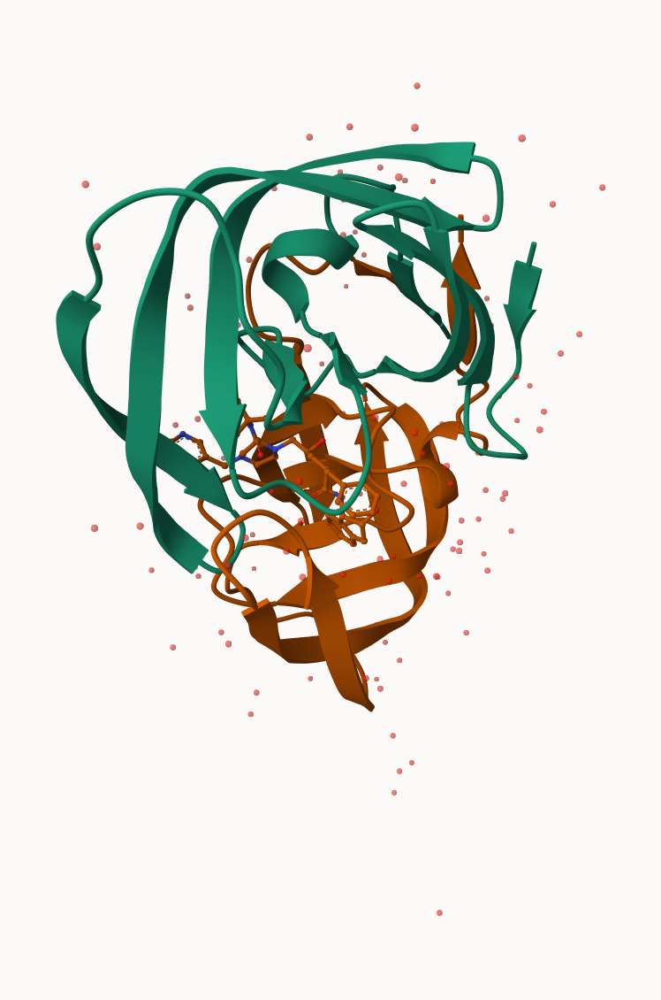
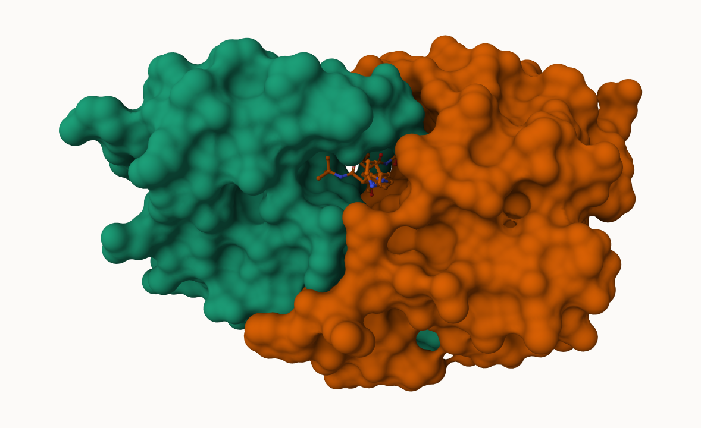
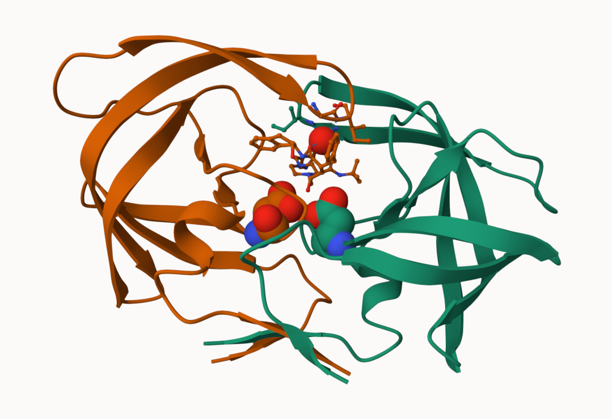

## Background

The main repository of high-resolution structural data on biomolecules is called **Protein Data Bank** (PDB). 

## PDB Statistics

What is in the PDB in terms of molecular determination 

```{r}
pdb <- read.csv("Data Export Summary.csv")
head(pdb)
```


> Q1: What percentage of structures in the PDB are solved by X-Ray and Electron Microscopy.

```{r}
pdb$X.ray
```
This print out above is `pdb$X.ray` is "character" not "numeric". Two functions can help here are `sub()` and `as.numeric()`:

```{r}
sum(as.numeric(sub(",", "", pdb$X.ray)))
```
Or we can make a function:

```{r}
rm.comma <- function(x) {
  sum(as.numeric(sub(",", "", x)))
}
```

```{r}
n.xray <- rm.comma(pdb$X.ray)
n.em <- rm.comma(pdb$EM)
n.tot <- rm.comma(pdb$Total)

n.xray/n.tot*100
n.em/n.tot*100
```


We could also use a different import function for this CSV. 

```{r}
library(readr)
pdb <- read_csv("Data Export Summary.csv")
head(pdb)
```
```{r}
n.xray <- sum(pdb$`X-ray`)
n.em <- sum(pdb$EM)
n.tot <- sum(pdb$Total)

n.xray / n.tot * 100
n.em / n.tot * 100
```

> Q2: What proportion of structures in the PDB are protein?


```{r}
pdb$Total[1]
```
The total number of protein sequences in Uniprot is 202,556,314

```{r}
217375/202556314*100
```
> **Keypoint**: WE have a very small structural coverage from known proteins (~0.1%). Most structures we know about (~80%) come from one method (X-ray crystalography). 


```{r}
protein_rows <- grepl("Protein", pdb$`Molecular Type`)

n.protein <- sum(pdb$Total[protein_rows])
n.total <- sum(pdb$Total)

n.protein / n.total * 100
```


> Q3: Type HIV in the PDB website search box on the home page and determine how many HIV-1 protease structures are in the current PDB?

4998


> Q4: Water molecules normally have 3 atoms. Why do we see just one atom per water molecule in this structure?

Water molecules appear as one atom because X-ray crystallography usually only detects the oxygen atom clearly. The two hydrogen atoms are too small/low in electron density, so they are usually not shown in the PDB model.

> Q5: There is a critical “conserved” water molecule in the binding site. Can you identify this water molecule? What residue number does this water molecule have

The critical conserved water molecule is usually water 301. In the structure, its residue number is 301, often labeled HOH 301 or WAT 301.

## Visualizing PDB data with Mal-star

Main stand alone web version with all feature is at https://molstar.org/viewer/.

> Q6: Generate and save a figure clearly showing the two distinct chains of HIV-protease along with the ligand. You might also consider showing the catalytic residues ASP 25 in each chain and the critical water (we recommend “Ball & Stick” for these side-chains). Add this figure to your Quarto document.








```{r}
#install.packages("pak")

#pak::pkg_install(c("bioboot/bio3dview",
#                   "NGLVieweR",
#                   "bioc::msa"))
```


# Getting started with the Bio3D package

> Q7: How many amino acid residues are there in this pdb object? 

There are 198 amino acid residues in this PDB object.

> Q8: Name one of the two non-protein residues? 

One non-protein residue is HOH.

> Q9: How many protein chains are in this structure?

There are 2 protein chains in this structure.


Bio3D is an R package from CRAN for structural bioinformatics. 

```{r}
library(bio3d)

pdb <- read.pdb("1hsg")
pdb
```

```{r}
head(pdb$atom)
```

There are lots of functions that can work with these `pdb` objects: 

```{r}
head(pdbseq(pdb))
```

```{r}
library(bio3dview)

# view.pdb(pdb)
```

Let's try a custom view:
```{r}
# view.pdb(pdb,colorScheme = "sse")
```

> Q. Create a custom view of HIV-Pr highlighting the active site ASP (`resno=25`), the two chains (in your choice of colors) and the ligand all on a custom color background. 

```{r}
# active.site <- atom.select(pdb, resno=25)

# view.pdb(pdb, 
#         cols = c("red", "blue"), 
#         highlight = active.site, 
#         highlight.style = "spacefill", 
#         backgroundColor = "pink" )
```


## Predict the flexibility of a given structure


Let's do a Normal Mode Analysis (NMA) to predict the flexibility of a given `pdb` object:

```{r}
adk <- read.pdb("6s36")
```

```{r}
adk
```

```{r}
m <- nma(adk)
plot(m)

```

View the results 
```{r}
# view.nma(m)
```

Write out the results for viewing in Mol-star:

```{r}
mktrj(m, file="nma.pdb")
```


## Comparative analysis of the ADK family 


> Q10. Which of the packages above is found only on BioConductor and not CRAN? 

msa

> Q11. Which of the above packages is not found on BioConductor or CRAN?: 

bio3dview

> Q12. True or False? Functions from the pak package can be used to install packages from GitHub and BitBucket? 

True

> Q13. How many amino acids are in this sequence, i.e. how long is this sequence? 

The sequence is 214 amino acids long.


Our first step is find a sequnece for this family. WE will use the database ID "1ake_A" here:

```{r}
id <- "1ake_A"

aa <- get.seq(id)
aa
```

Search for related sequences in the database

```{r}
blast <- blast.pdb(aa)
```

```{r}
head(blast$hit.tbl)
```

```{r}
hits <- plot(blast)
```

```{r}
hits$pdb.id
```
```{r}
files <- get.pdb(hits$pdb.id, path="pdbs", split=TRUE, gzip=TRUE)
```


Align and supperpose all these ADK structures 
```{r}
pdbs <- pdbaln(files, fit = TRUE, exefile="msa")
```


```{r}
pdbs
```


```{r}
# view.pdbs(pdbs)
```

PCA of all this structural data (x,y,and z atom corrdinates):

```{r}
pc <- pca(pdbs)
plot(pc)
```

```{r}
plot(pc, 1:2)
```

Interactive view of the PC1 captured structural differences: 

```{r}
# view.pca(pc)
```

```{r}
mktrj(pc, file="pca.pdb")
```


