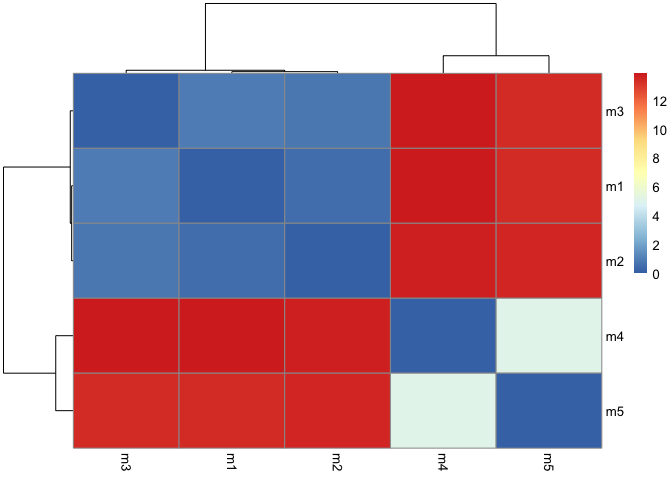
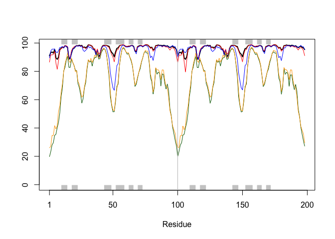
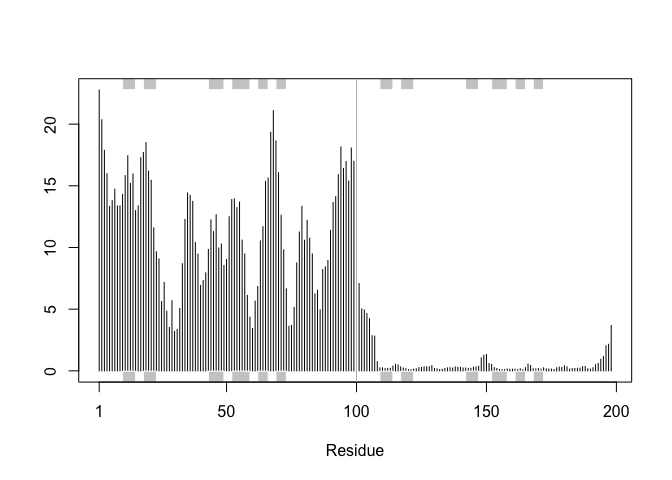
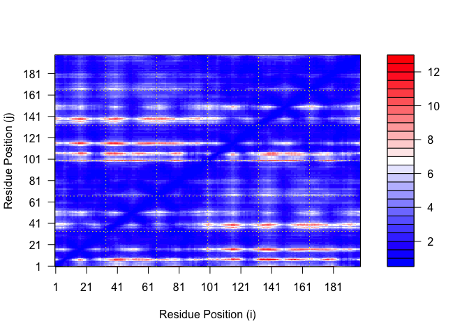
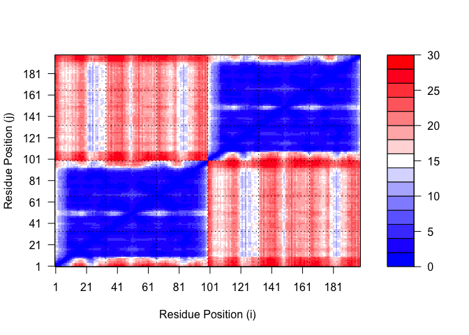
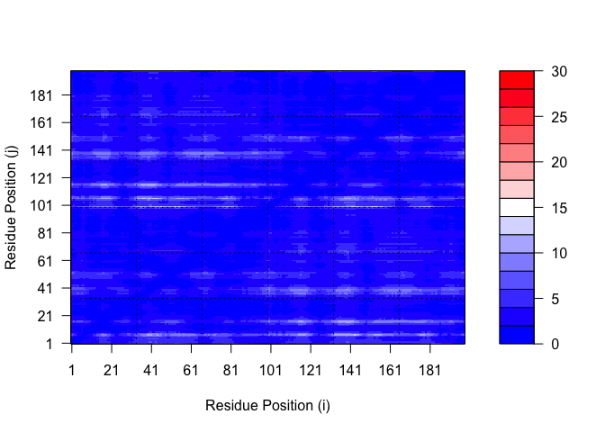
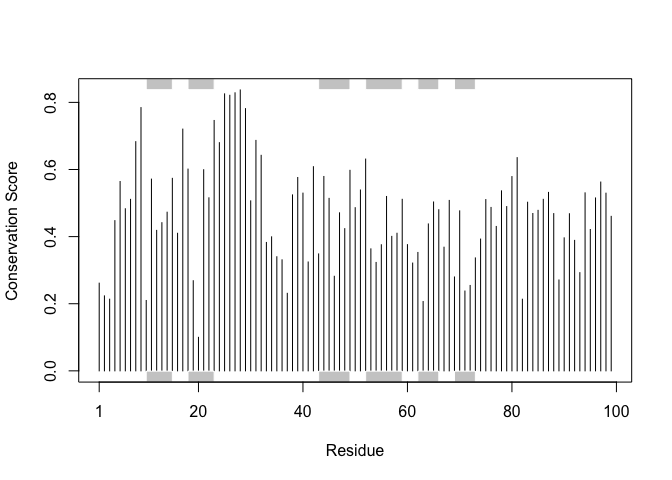

# Class 11: AlphaFold
Zeyu Qi(A17342618)

``` r
library(bio3d)

pdb <- read.pdb("hivpr_dimer_23119/hivpr_dimer_23119_unrelaxed_rank_002_alphafold2_multimer_v3_model_1_seed_000.pdb")
```

Make a vector of input PDB file names that can read into R

``` r
pdbfiles <- list.files("hivpr_dimer_23119/", 
                       pattern = ".pdb",
                       full.names = TRUE)
```

``` r
library(bio3d)

# Read all data from Models 
#  and superpose/fit coords
pdbs <- pdbaln(pdbfiles, fit=TRUE, exefile="msa")
```

    Reading PDB files:
    hivpr_dimer_23119//hivpr_dimer_23119_unrelaxed_rank_001_alphafold2_multimer_v3_model_4_seed_000.pdb
    hivpr_dimer_23119//hivpr_dimer_23119_unrelaxed_rank_002_alphafold2_multimer_v3_model_1_seed_000.pdb
    hivpr_dimer_23119//hivpr_dimer_23119_unrelaxed_rank_003_alphafold2_multimer_v3_model_5_seed_000.pdb
    hivpr_dimer_23119//hivpr_dimer_23119_unrelaxed_rank_004_alphafold2_multimer_v3_model_3_seed_000.pdb
    hivpr_dimer_23119//hivpr_dimer_23119_unrelaxed_rank_005_alphafold2_multimer_v3_model_2_seed_000.pdb
    .....

    Extracting sequences

    pdb/seq: 1   name: hivpr_dimer_23119//hivpr_dimer_23119_unrelaxed_rank_001_alphafold2_multimer_v3_model_4_seed_000.pdb 
    pdb/seq: 2   name: hivpr_dimer_23119//hivpr_dimer_23119_unrelaxed_rank_002_alphafold2_multimer_v3_model_1_seed_000.pdb 
    pdb/seq: 3   name: hivpr_dimer_23119//hivpr_dimer_23119_unrelaxed_rank_003_alphafold2_multimer_v3_model_5_seed_000.pdb 
    pdb/seq: 4   name: hivpr_dimer_23119//hivpr_dimer_23119_unrelaxed_rank_004_alphafold2_multimer_v3_model_3_seed_000.pdb 
    pdb/seq: 5   name: hivpr_dimer_23119//hivpr_dimer_23119_unrelaxed_rank_005_alphafold2_multimer_v3_model_2_seed_000.pdb 

``` r
rd <- rmsd(pdbs, fit=T)
```

    Warning in rmsd(pdbs, fit = T): No indices provided, using the 198 non NA positions

``` r
range(rd)
```

    [1]  0.000 13.888

``` r
library(pheatmap)

colnames(rd) <- paste0("m",1:5)
rownames(rd) <- paste0("m",1:5)
pheatmap(rd)
```



``` r
# Read a reference PDB structure
pdb <- read.pdb("1hsg")
```

      Note: Accessing on-line PDB file

``` r
plotb3(pdbs$b[1,], typ="l", lwd=2, sse=pdb)
points(pdbs$b[2,], typ="l", col="red")
points(pdbs$b[3,], typ="l", col="blue")
points(pdbs$b[4,], typ="l", col="darkgreen")
points(pdbs$b[5,], typ="l", col="orange")
abline(v=100, col="gray")
```



``` r
core <- core.find(pdbs)
```

     core size 197 of 198  vol = 6732.277 
     core size 196 of 198  vol = 6404.498 
     core size 195 of 198  vol = 5109.231 
     core size 194 of 198  vol = 3180.814 
     core size 193 of 198  vol = 2542.63 
     core size 192 of 198  vol = 2361.481 
     core size 191 of 198  vol = 2245.469 
     core size 190 of 198  vol = 2128.99 
     core size 189 of 198  vol = 2041.545 
     core size 188 of 198  vol = 1956.704 
     core size 187 of 198  vol = 1885.422 
     core size 186 of 198  vol = 1814.183 
     core size 185 of 198  vol = 1753.586 
     core size 184 of 198  vol = 1705.055 
     core size 183 of 198  vol = 1642.105 
     core size 182 of 198  vol = 1599.234 
     core size 181 of 198  vol = 1544.183 
     core size 180 of 198  vol = 1499.919 
     core size 179 of 198  vol = 1453.589 
     core size 178 of 198  vol = 1411.37 
     core size 177 of 198  vol = 1374.172 
     core size 176 of 198  vol = 1348.898 
     core size 175 of 198  vol = 1322.722 
     core size 174 of 198  vol = 1278.394 
     core size 173 of 198  vol = 1237.868 
     core size 172 of 198  vol = 1194.871 
     core size 171 of 198  vol = 1149.916 
     core size 170 of 198  vol = 1115.748 
     core size 169 of 198  vol = 1074.461 
     core size 168 of 198  vol = 1041.82 
     core size 167 of 198  vol = 1015.099 
     core size 166 of 198  vol = 982.853 
     core size 165 of 198  vol = 948.684 
     core size 164 of 198  vol = 910.883 
     core size 163 of 198  vol = 877.107 
     core size 162 of 198  vol = 848.809 
     core size 161 of 198  vol = 826.047 
     core size 160 of 198  vol = 798.374 
     core size 159 of 198  vol = 775.687 
     core size 158 of 198  vol = 748.519 
     core size 157 of 198  vol = 729.604 
     core size 156 of 198  vol = 703.151 
     core size 155 of 198  vol = 676.43 
     core size 154 of 198  vol = 656.323 
     core size 153 of 198  vol = 631.851 
     core size 152 of 198  vol = 605.743 
     core size 151 of 198  vol = 569.843 
     core size 150 of 198  vol = 544.115 
     core size 149 of 198  vol = 517.354 
     core size 148 of 198  vol = 494.921 
     core size 147 of 198  vol = 479.374 
     core size 146 of 198  vol = 453.303 
     core size 145 of 198  vol = 435.934 
     core size 144 of 198  vol = 417.06 
     core size 143 of 198  vol = 398.538 
     core size 142 of 198  vol = 374.827 
     core size 141 of 198  vol = 354.269 
     core size 140 of 198  vol = 336.307 
     core size 139 of 198  vol = 318.544 
     core size 138 of 198  vol = 308.804 
     core size 137 of 198  vol = 295.052 
     core size 136 of 198  vol = 279.398 
     core size 135 of 198  vol = 269.454 
     core size 134 of 198  vol = 254.195 
     core size 133 of 198  vol = 239.592 
     core size 132 of 198  vol = 224.085 
     core size 131 of 198  vol = 211.153 
     core size 130 of 198  vol = 200.038 
     core size 129 of 198  vol = 189.628 
     core size 128 of 198  vol = 179.866 
     core size 127 of 198  vol = 170.227 
     core size 126 of 198  vol = 163.445 
     core size 125 of 198  vol = 154.14 
     core size 124 of 198  vol = 147.598 
     core size 123 of 198  vol = 141.253 
     core size 122 of 198  vol = 135.249 
     core size 121 of 198  vol = 128.059 
     core size 120 of 198  vol = 120.252 
     core size 119 of 198  vol = 112.759 
     core size 118 of 198  vol = 105.287 
     core size 117 of 198  vol = 99.903 
     core size 116 of 198  vol = 94.13 
     core size 115 of 198  vol = 87.053 
     core size 114 of 198  vol = 81.136 
     core size 113 of 198  vol = 74.821 
     core size 112 of 198  vol = 67.365 
     core size 111 of 198  vol = 59.58 
     core size 110 of 198  vol = 53.042 
     core size 109 of 198  vol = 46.554 
     core size 108 of 198  vol = 43.411 
     core size 107 of 198  vol = 40.091 
     core size 106 of 198  vol = 34.351 
     core size 105 of 198  vol = 31.465 
     core size 104 of 198  vol = 27.543 
     core size 103 of 198  vol = 24.482 
     core size 102 of 198  vol = 21.186 
     core size 101 of 198  vol = 18.171 
     core size 100 of 198  vol = 17.001 
     core size 99 of 198  vol = 12.927 
     core size 98 of 198  vol = 11.103 
     core size 97 of 198  vol = 9.485 
     core size 96 of 198  vol = 7.712 
     core size 95 of 198  vol = 6.546 
     core size 94 of 198  vol = 5.671 
     core size 93 of 198  vol = 4.844 
     core size 92 of 198  vol = 3.497 
     core size 91 of 198  vol = 2.256 
     core size 90 of 198  vol = 1.684 
     core size 89 of 198  vol = 1.116 
     core size 88 of 198  vol = 0.972 
     core size 87 of 198  vol = 0.91 
     core size 86 of 198  vol = 0.723 
     core size 85 of 198  vol = 0.563 
     core size 84 of 198  vol = 0.458 
     FINISHED: Min vol ( 0.5 ) reached

``` r
core.inds <- print(core, vol=0.5)
```

    # 85 positions (cumulative volume <= 0.5 Angstrom^3) 
      start end length
    1     9  48     40
    2    52  96     45

``` r
xyz <- pdbfit(pdbs, core.inds, outpath="corefit_structures")
rf <- rmsf(xyz)

plotb3(rf, sse=pdb)
abline(v=100, col="gray", ylab="RMSF")
```



``` r
library(jsonlite)

# Listing of all PAE JSON files
pae_files <- list.files(path="hivpr_dimer_23119",
                        pattern=".*model.*\\.json",
                        full.names = TRUE)
```

``` r
pae1 <- read_json(pae_files[1],simplifyVector = TRUE)
pae5 <- read_json(pae_files[5],simplifyVector = TRUE)

attributes(pae1)
```

    $names
    [1] "plddt"   "max_pae" "pae"     "ptm"     "iptm"   

``` r
# Per-residue pLDDT scores 
#  same as B-factor of PDB..
head(pae1$plddt) 
```

    [1] 90.94 93.25 93.69 92.88 95.31 89.50

``` r
pae1$max_pae
```

    [1] 12.6875

``` r
pae5$max_pae
```

    [1] 29.54688

``` r
plot.dmat(pae1$pae, 
          xlab="Residue Position (i)",
          ylab="Residue Position (j)")
```



``` r
plot.dmat(pae5$pae, 
          xlab="Residue Position (i)",
          ylab="Residue Position (j)",
          grid.col = "black",
          zlim=c(0,30))
```



``` r
plot.dmat(pae1$pae, 
          xlab="Residue Position (i)",
          ylab="Residue Position (j)",
          grid.col = "black",
          zlim=c(0,30))
```



``` r
aln_file <- list.files(path="hivpr_dimer_23119",
                       pattern=".a3m$",
                        full.names = TRUE)
aln_file
```

    [1] "hivpr_dimer_23119/hivpr_dimer_23119.a3m"

``` r
aln <- read.fasta(aln_file[1], to.upper = TRUE)
```

    [1] " ** Duplicated sequence id's: 101 **"
    [2] " ** Duplicated sequence id's: 101 **"

``` r
dim(aln$ali)
```

    [1] 5397  132

``` r
sim <- conserv(aln)
plotb3(sim[1:99], sse=trim.pdb(pdb, chain="A"),
       ylab="Conservation Score")
```



``` r
con <- consensus(aln, cutoff = 0.9)
con$seq
```

      [1] "-" "-" "-" "-" "-" "-" "-" "-" "-" "-" "-" "-" "-" "-" "-" "-" "-" "-"
     [19] "-" "-" "-" "-" "-" "-" "D" "T" "G" "A" "-" "-" "-" "-" "-" "-" "-" "-"
     [37] "-" "-" "-" "-" "-" "-" "-" "-" "-" "-" "-" "-" "-" "-" "-" "-" "-" "-"
     [55] "-" "-" "-" "-" "-" "-" "-" "-" "-" "-" "-" "-" "-" "-" "-" "-" "-" "-"
     [73] "-" "-" "-" "-" "-" "-" "-" "-" "-" "-" "-" "-" "-" "-" "-" "-" "-" "-"
     [91] "-" "-" "-" "-" "-" "-" "-" "-" "-" "-" "-" "-" "-" "-" "-" "-" "-" "-"
    [109] "-" "-" "-" "-" "-" "-" "-" "-" "-" "-" "-" "-" "-" "-" "-" "-" "-" "-"
    [127] "-" "-" "-" "-" "-" "-"

``` r
m1.pdb <- read.pdb(pdbfiles[1])
occ <- vec2resno(c(sim[1:99], sim[1:99]), m1.pdb$atom$resno)
write.pdb(m1.pdb, o=occ, file="m1_conserv.pdb")
```
