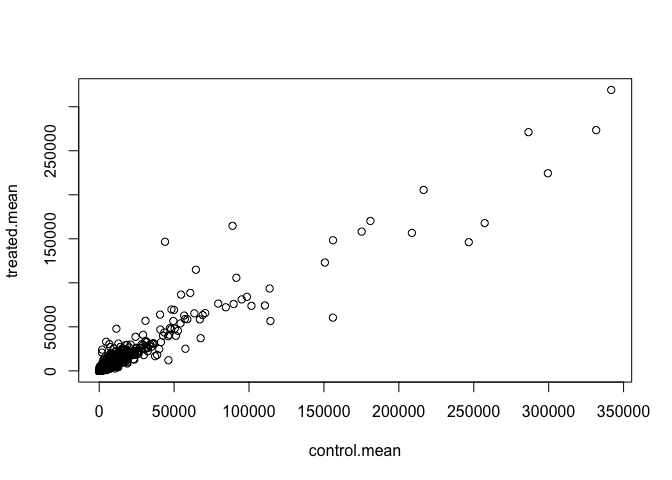
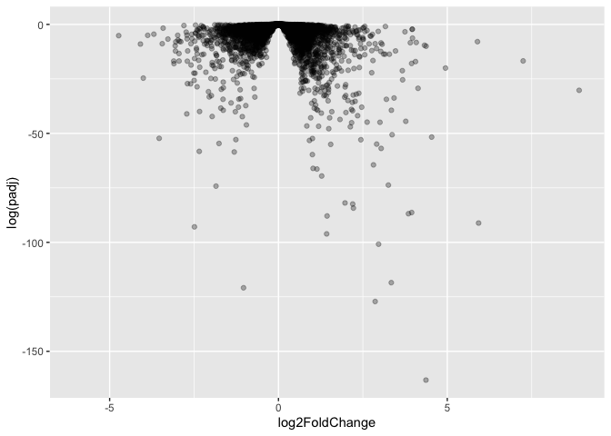
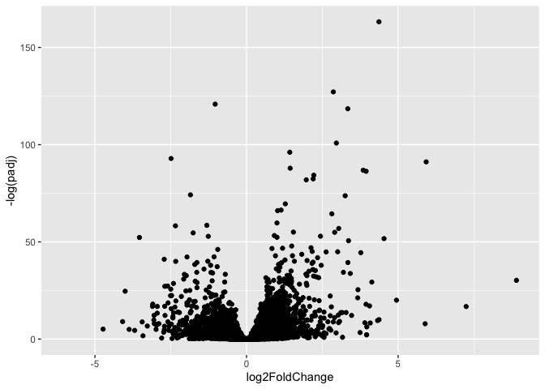

# Class13: RNASeq analysis with DESeq
Zeyu Qi(A17342618)

- [Background](#background)
- [Data Import](#data-import)
- [DESeq analysis](#deseq-analysis)
- [Volcano plot](#volcano-plot)
- [Save results to date](#save-results-to-date)
- [Adding annotation data](#adding-annotation-data)
- [Pathway analysis](#pathway-analysis)
- [Save our annotated results](#save-our-annotated-results)

## Background

Today we are going to do an RNA-seq analysis of a data set on the common
glucocorticoid steroid dexamethasone (dex), and we will use DESeq for
this analysis.

## Data Import

Let’s read the `count` data and the `metadata` about this experiment
setup from the supplied CSV files:

``` r
counts <- read.csv("airway_scaledcounts.csv", row.names = 1)
metadata <- read.csv("airway_metadata.csv")
```

Have a peak:

``` r
head(counts)
```

                    SRR1039508 SRR1039509 SRR1039512 SRR1039513 SRR1039516
    ENSG00000000003        723        486        904        445       1170
    ENSG00000000005          0          0          0          0          0
    ENSG00000000419        467        523        616        371        582
    ENSG00000000457        347        258        364        237        318
    ENSG00000000460         96         81         73         66        118
    ENSG00000000938          0          0          1          0          2
                    SRR1039517 SRR1039520 SRR1039521
    ENSG00000000003       1097        806        604
    ENSG00000000005          0          0          0
    ENSG00000000419        781        417        509
    ENSG00000000457        447        330        324
    ENSG00000000460         94        102         74
    ENSG00000000938          0          0          0

and the meta data that tells us what is actually in tghe columns of our
`count` object:

``` r
metadata
```

              id     dex celltype     geo_id
    1 SRR1039508 control   N61311 GSM1275862
    2 SRR1039509 treated   N61311 GSM1275863
    3 SRR1039512 control  N052611 GSM1275866
    4 SRR1039513 treated  N052611 GSM1275867
    5 SRR1039516 control  N080611 GSM1275870
    6 SRR1039517 treated  N080611 GSM1275871
    7 SRR1039520 control  N061011 GSM1275874
    8 SRR1039521 treated  N061011 GSM1275875

> Q1. How many genes are in this dataset?

``` r
nrow(counts)
```

    [1] 38694

There are 38694 genes in this data set.

> Q2. How many ‘control’ cell lines do we have?

``` r
sum(metadata$dex=="control")
```

    [1] 4

We have 4 control cell lines.

> Q3. How would you make the above code in either approach more robust?
> Is there a function that could help here?

rowSums

``` r
colnames(counts) == metadata$id
```

    [1] TRUE TRUE TRUE TRUE TRUE TRUE TRUE TRUE

- Find the “control” columns in our `counts` object
- Extract just the “control” column values for all genes
- Calculate the average value per gene in these “control” columns

``` r
control.inds <- metadata$dex=="control"
control.counts <- counts[ , control.inds]
control.mean <- rowMeans(control.counts)
```

> Q4. Follow the same procedure for the treated samples (i.e. calculate
> the mean per gene across drug treated samples and assign to a labeled
> vector called treated.mean)

Now do the same for the “treated” columns:

``` r
treated.inds <- metadata$dex=="treated"
treated.counts <- counts[ , treated.inds]
treated.mean <- rowMeans(treated.counts)
```

For book-keeping, let’s store these together as a new object called
`meancounts`

``` r
meancounts <- data.frame(control.mean, treated.mean)
```

> Q5 (a). Create a scatter plot showing the mean of the treated samples
> against the mean of the control samples.

``` r
plot(control.mean, treated.mean)
```



> Q5 (b).You could also use the ggplot2 package to make this figure
> producing the plot below. What geom\_?() function would you use for
> this plot?

geom_point

> Q6. Try plotting both axes on a log scale. What is the argument to
> plot() that allows you to do this?

log=“xy”

Our count data is highly skewed and when we see a pattern like this plot
it SCREEMS log transform me!

``` r
plot(meancounts, log="xy")
```

    Warning in xy.coords(x, y, xlabel, ylabel, log): 15032 x values <= 0 omitted
    from logarithmic plot

    Warning in xy.coords(x, y, xlabel, ylabel, log): 15281 y values <= 0 omitted
    from logarithmic plot


We most often use log2 transform for this kind of data in
bioinformatics.

``` r
log2(80/20)
```

    [1] 2

``` r
log2(20/20)
```

    [1] 0

``` r
log2(40/20)
```

    [1] 1

``` r
log2(10/20)
```

    [1] -1

We call this little fraction “log2 fold change” as it tells how much
more or less gene expression we have in units of doubling, etc.

Let’s calculate the log2 fold change for our `treated.mean` and
`control.mean` counts and call this `log2fc`.

``` r
meancounts$log2fc <- log2(meancounts$treated.mean / meancounts$control.mean)
head(meancounts)
```

                    control.mean treated.mean      log2fc
    ENSG00000000003       900.75       658.00 -0.45303916
    ENSG00000000005         0.00         0.00         NaN
    ENSG00000000419       520.50       546.00  0.06900279
    ENSG00000000457       339.75       316.50 -0.10226805
    ENSG00000000460        97.25        78.75 -0.30441833
    ENSG00000000938         0.75         0.00        -Inf

A common “rule of thumb” threshold for calling a gene “up regulated” or
“down regulated” is a log2 fold-change value of +2 or -2 (or greater)

> Q7. What is the purpose of the arr.ind argument in the which()
> function call above? Why would we then take the first column of the
> output and need to call the unique() function?

arr.ind = TRUE makes which() return the row and column indices of
matching values instead of one long position vector. We take the first
column to get the row numbers containing matches, and use unique()
because the same row may match in multiple columns.

> Q8. Using the up.ind vector above can you determine how many up
> regulated genes we have at the greater than 2 fc level?

250

> Q9. Using the down.ind vector above can you determine how many down
> regulated genes we have at the greater than 2 fc level?

367

> Q10. Do you trust these results? Why or why not?

These results in their current form are likely to be very misleading.
More annotation and analysis can be done.

## DESeq analysis

Let’s do this analyze properly and not forget about the significance of
the differences.

For this we will use the **DESeq2** package.

``` r
library(DESeq2)
```

To run a DESeq analysis we need at least two inputs:

- `countData` i.e. are genes counts across different experiments
- `colData` i.e. our metadata about those count columns

``` r
dds <- DESeqDataSetFromMatrix(countData = counts,
                              colData = metadata,
                              design = ~dex)
```

    converting counts to integer mode

Now we can run the DESeq analysis pipline using this `dds` object taht
has all the inputs we need.

``` r
dds <- DESeq(dds)
```

    estimating size factors

    estimating dispersions

    gene-wise dispersion estimates

    mean-dispersion relationship

    final dispersion estimates

    fitting model and testing

``` r
res <- results(dds)
head(res)
```

    log2 fold change (MLE): dex treated vs control 
    Wald test p-value: dex treated vs control 
    DataFrame with 6 rows and 6 columns
                      baseMean log2FoldChange     lfcSE      stat    pvalue
                     <numeric>      <numeric> <numeric> <numeric> <numeric>
    ENSG00000000003 747.194195      -0.350703  0.168242 -2.084514 0.0371134
    ENSG00000000005   0.000000             NA        NA        NA        NA
    ENSG00000000419 520.134160       0.206107  0.101042  2.039828 0.0413675
    ENSG00000000457 322.664844       0.024527  0.145134  0.168996 0.8658000
    ENSG00000000460  87.682625      -0.147143  0.256995 -0.572550 0.5669497
    ENSG00000000938   0.319167      -1.732289  3.493601 -0.495846 0.6200029
                         padj
                    <numeric>
    ENSG00000000003  0.163017
    ENSG00000000005        NA
    ENSG00000000419  0.175937
    ENSG00000000457  0.961682
    ENSG00000000460  0.815805
    ENSG00000000938        NA

## Volcano plot

This is an ubiquitous and common visualization for this type of data
that puts the log2 foldchange and the adjusted p-value together in one
plot taht people can get insight for what is going on in the whole data
set results.

``` r
library(ggplot2)

ggplot(res) +
  aes(log2FoldChange, padj) +
  geom_point(alpha=0.3)
```

    Warning: Removed 23549 rows containing missing values or values outside the scale range
    (`geom_point()`).


That plot is not very useful because we don’t compare genes with high
p-values, we want the very low values below our alpha threshold
(e.g. 0.01)

Let’s log the y-axis so we can see these genes/points more clearly:

``` r
library(ggplot2)

ggplot(res) +
  aes(log2FoldChange, log(padj)) +
  geom_point(alpha=0.3)
```

    Warning: Removed 23549 rows containing missing values or values outside the scale range
    (`geom_point()`).



We need to flip the y-axis

``` r
ggplot(res) +
  aes(log2FoldChange, -log(padj)) +
  geom_point()
```

    Warning: Removed 23549 rows containing missing values or values outside the scale range
    (`geom_point()`).



> Q. Add annotation to this volcano plot includding the log2 fold-change
> threshold of +2 and -2 and the p-value threshold of 0.05. Also color
> up just the genes that meet both thresholds. These are ones we will
> focus on.

``` r
# Setup our custom point color vector 
mycols <- rep("gray", nrow(res))
mycols[ abs(res$log2FoldChange) > 2 ]  <- "red" 

inds <- (res$padj < 0.01) & (abs(res$log2FoldChange) > 2 )
mycols[ inds ] <- "blue"

# Volcano plot with custom colors 
plot( res$log2FoldChange,  -log(res$padj), 
 col=mycols, ylab="-Log(P-value)", xlab="Log2(FoldChange)" )

# Cut-off lines
abline(v=c(-2,2), col="gray", lty=2)
abline(h=-log(0.1), col="gray", lty=2)
```


## Save results to date

``` r
write.csv(res, file="myresults.csv")
```

## Adding annotation data

We need to “map” or “translate” out ENSEMBLE gene identifiers in our
results object to date to the identifiers used in different databases we
want to use fro learning more about these genes.

For this we will use a couple of BioConductor packages.

``` r
library(AnnotationDbi)
library(org.Hs.eg.db)
```

We can see the column in `org.Hs.eg.db` that list the different
databases we can map between

``` r
columns(org.Hs.eg.db)
```

     [1] "ACCNUM"       "ALIAS"        "ENSEMBL"      "ENSEMBLPROT"  "ENSEMBLTRANS"
     [6] "ENTREZID"     "ENZYME"       "EVIDENCE"     "EVIDENCEALL"  "GENENAME"    
    [11] "GENETYPE"     "GO"           "GOALL"        "IPI"          "MAP"         
    [16] "OMIM"         "ONTOLOGY"     "ONTOLOGYALL"  "PATH"         "PFAM"        
    [21] "PMID"         "PROSITE"      "REFSEQ"       "SYMBOL"       "UCSCKG"      
    [26] "UNIPROT"     

We can now use the `mapIDs()` function to map between the different
database identifier formats:

``` r
res$symbol <- mapIds(org.Hs.eg.db,
                     keys=row.names(res), 
                     keytype="ENSEMBL",
                     column="SYMBOL",
                     multiVals="first")
```

    'select()' returned 1:many mapping between keys and columns

``` r
head(res)
```

    log2 fold change (MLE): dex treated vs control 
    Wald test p-value: dex treated vs control 
    DataFrame with 6 rows and 7 columns
                      baseMean log2FoldChange     lfcSE      stat    pvalue
                     <numeric>      <numeric> <numeric> <numeric> <numeric>
    ENSG00000000003 747.194195      -0.350703  0.168242 -2.084514 0.0371134
    ENSG00000000005   0.000000             NA        NA        NA        NA
    ENSG00000000419 520.134160       0.206107  0.101042  2.039828 0.0413675
    ENSG00000000457 322.664844       0.024527  0.145134  0.168996 0.8658000
    ENSG00000000460  87.682625      -0.147143  0.256995 -0.572550 0.5669497
    ENSG00000000938   0.319167      -1.732289  3.493601 -0.495846 0.6200029
                         padj      symbol
                    <numeric> <character>
    ENSG00000000003  0.163017      TSPAN6
    ENSG00000000005        NA        TNMD
    ENSG00000000419  0.175937        DPM1
    ENSG00000000457  0.961682       SCYL3
    ENSG00000000460  0.815805       FIRRM
    ENSG00000000938        NA         FGR

> Q11. Run the mapIds() function two more times to add the Entrez ID and
> UniProt accession and GENENAME as new columns called
> res$entrez, res$uniprot and res\$genename.

> Q. Can you map “GENENAME” and aadd as a new column to our `res`
> object?

``` r
res$genename <- mapIds(org.Hs.eg.db,
                     keys=row.names(res), 
                     keytype="ENSEMBL",
                     column="GENENAME")
```

    'select()' returned 1:many mapping between keys and columns

> Q. Add “ENTREZID” as `res$entrez`?

``` r
res$entrez <- mapIds(org.Hs.eg.db,
                     keys=row.names(res), 
                     keytype="ENSEMBL",
                     column="ENTREZID")
```

    'select()' returned 1:many mapping between keys and columns

## Pathway analysis

Now we have our annotated results with their log2 fold-change and
p-values we can figure out which biological pathways and process these
genes are involved with.

We will use the **gage** and **pathview** package fot this step.

``` r
library(gage)
library(gageData)
library(pathview)
```

``` r
data(kegg.sets.hs)

# Examine the first 2 pathways in this kegg set for humans
head(kegg.sets.hs, 2)
```

    $`hsa00232 Caffeine metabolism`
    [1] "10"   "1544" "1548" "1549" "1553" "7498" "9"   

    $`hsa00983 Drug metabolism - other enzymes`
     [1] "10"     "1066"   "10720"  "10941"  "151531" "1548"   "1549"   "1551"  
     [9] "1553"   "1576"   "1577"   "1806"   "1807"   "1890"   "221223" "2990"  
    [17] "3251"   "3614"   "3615"   "3704"   "51733"  "54490"  "54575"  "54576" 
    [25] "54577"  "54578"  "54579"  "54600"  "54657"  "54658"  "54659"  "54963" 
    [33] "574537" "64816"  "7083"   "7084"   "7172"   "7363"   "7364"   "7365"  
    [41] "7366"   "7367"   "7371"   "7372"   "7378"   "7498"   "79799"  "83549" 
    [49] "8824"   "8833"   "9"      "978"   

We need a named vector of importance (e.g. fold-change values) that has
gene ids as names. These names need to be in the correct format (using
the correct database format for the IDs).

``` r
x <- c(10,9,7)
names(x) <- c("alice", "baa", "coo")
x
```

    alice   baa   coo 
       10     9     7 

Here we will make a wee input vector called `foldchange` that has
“entrez” ids as names

``` r
foldchanges <- res$log2FoldChange
names(foldchanges) <- res$entrez
```

Now we can run `gage()` to do our pathway analysis

``` r
# Get the results
keggres = gage(foldchanges, gsets=kegg.sets.hs)
```

``` r
attributes(keggres)
```

    $names
    [1] "greater" "less"    "stats"  

Look at the first three down (less) pathways

``` r
head(keggres$less, 3)
```

                                          p.geomean stat.mean        p.val
    hsa05332 Graft-versus-host disease 0.0004250607 -3.473335 0.0004250607
    hsa04940 Type I diabetes mellitus  0.0017820379 -3.002350 0.0017820379
    hsa05310 Asthma                    0.0020046180 -3.009045 0.0020046180
                                            q.val set.size         exp1
    hsa05332 Graft-versus-host disease 0.09053792       40 0.0004250607
    hsa04940 Type I diabetes mellitus  0.14232788       42 0.0017820379
    hsa05310 Asthma                    0.14232788       29 0.0020046180

Now we can use the **pathview** package with found KEGG pathway IDs
(e.g. “hsa05310” for Asthma pathway) to make a pathway figure showing
our Differential Expressed Genes (DEGs)

``` r
# A different PDF based output of the same data
pathview(gene.data=foldchanges, pathway.id="hsa05310")
```

    'select()' returned 1:1 mapping between keys and columns

    Info: Working in directory /Users/edwardqi/Desktop/BIMM 143/bimm_143_github/class13

    Info: Writing image file hsa05310.pathview.png


> Q12. Can you do the same procedure as above to plot the pathview
> figures for the top 2 down-reguled pathways?

``` r
down_pathways <- rownames(keggres$less)[1:2]

down_ids <- substr(down_pathways, start = 1, stop = 8)

down_ids
```

    [1] "hsa05332" "hsa04940"

``` r
pathview(gene.data=foldchanges, pathway.id="hsa05332")
```

    'select()' returned 1:1 mapping between keys and columns

    Info: Working in directory /Users/edwardqi/Desktop/BIMM 143/bimm_143_github/class13

    Info: Writing image file hsa05332.pathview.png


``` r
pathview(gene.data=foldchanges, pathway.id="hsa04940")
```

    'select()' returned 1:1 mapping between keys and columns

    Info: Working in directory /Users/edwardqi/Desktop/BIMM 143/bimm_143_github/class13

    Info: Writing image file hsa04940.pathview.png


## Save our annotated results

``` r
write.csv(res, file="myresults_annotated.csv")
```
