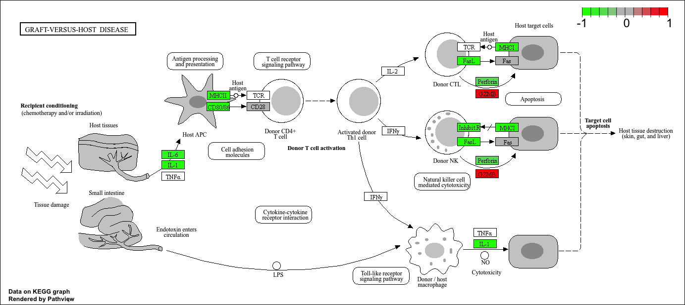
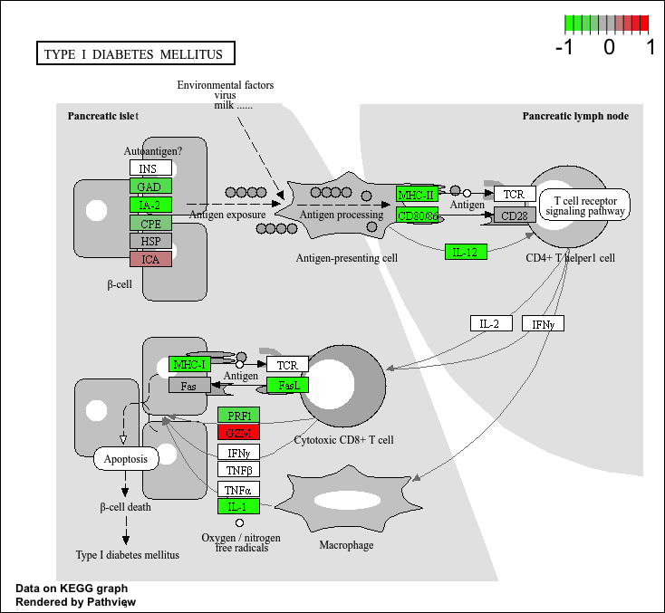

## Background

Today we are going to do an RNA-seq analysis of a data set on the common glucocorticoid steroid dexamethasone (dex), and we will use DESeq for this analysis. 

## Data Import  

Let's read the `count` data and the `metadata` about this experiment setup from the supplied CSV files:

```{r}
counts <- read.csv("airway_scaledcounts.csv", row.names = 1)
metadata <- read.csv("airway_metadata.csv")
```

Have a peak:
```{r}
head(counts)
```

and the meta data that tells us what is actually in tghe columns of our `count` object:

```{r}
metadata
```

> Q1. How many genes are in this dataset?

```{r}
nrow(counts)
```

There are 38694 genes in this data set. 


> Q2. How many ‘control’ cell lines do we have? 

```{r}
sum(metadata$dex=="control")
```
We have 4 control cell lines. 

> Q3. How would you make the above code in either approach more robust? Is there a function that could help here? 

rowSums

```{r}
colnames(counts) == metadata$id
```

- Find the "control" columns in our `counts` object
- Extract just the "control" column values for all genes
- Calculate the average value per gene in these "control" columns

```{r}
control.inds <- metadata$dex=="control"
control.counts <- counts[ , control.inds]
control.mean <- rowMeans(control.counts)
```

> Q4. Follow the same procedure for the treated samples (i.e. calculate the mean per gene across drug treated samples and assign to a labeled vector called treated.mean)

Now do the same for the "treated" columns:
```{r}
treated.inds <- metadata$dex=="treated"
treated.counts <- counts[ , treated.inds]
treated.mean <- rowMeans(treated.counts)
```

For book-keeping, let's store these together as a new object called `meancounts`

```{r}
meancounts <- data.frame(control.mean, treated.mean)
```

> Q5 (a). Create a scatter plot showing the mean of the treated samples against the mean of the control samples. 

```{r}
plot(control.mean, treated.mean)
```
> Q5 (b).You could also use the ggplot2 package to make this figure producing the plot below. What geom_?() function would you use for this plot?

geom_point

> Q6. Try plotting both axes on a log scale. What is the argument to plot() that allows you to do this? 

log="xy"


Our count data is highly skewed and when we see a pattern like this plot it SCREEMS log transform me!

```{r}
plot(meancounts, log="xy")
```


We most often use log2 transform for this kind of data in bioinformatics. 

```{r}
log2(80/20)
log2(20/20)
log2(40/20)
log2(10/20)
```

We call this little fraction "log2 fold change" as it tells how much more or less gene expression we have in units of doubling, etc. 

Let's calculate the log2 fold change for our `treated.mean` and `control.mean` counts and call this `log2fc`. 

```{r}
meancounts$log2fc <- log2(meancounts$treated.mean / meancounts$control.mean)
head(meancounts)
```

A common "rule of thumb" threshold for calling a gene "up regulated" or "down regulated" is a log2 fold-change value of +2 or -2 (or greater)


> Q7. What is the purpose of the arr.ind argument in the which() function call above? Why would we then take the first column of the output and need to call the unique() function?

arr.ind = TRUE makes which() return the row and column indices of matching values instead of one long position vector. We take the first column to get the row numbers containing matches, and use unique() because the same row may match in multiple columns.

> Q8. Using the up.ind vector above can you determine how many up regulated genes we have at the greater than 2 fc level? 

250

> Q9. Using the down.ind vector above can you determine how many down regulated genes we have at the greater than 2 fc level? 

367

> Q10. Do you trust these results? Why or why not?

These results in their current form are likely to be very misleading. More annotation and analysis can be done. 


## DESeq analysis

Let's do this analyze properly and not forget about the significance of the differences.

For this we will use the **DESeq2** package.

```{r, message=FALSE}
library(DESeq2)
```

To run a DESeq analysis we need at least two inputs:

- `countData` i.e. are genes counts across different experiments
- `colData` i.e. our metadata about those count columns

```{r, warning=FALSE}
dds <- DESeqDataSetFromMatrix(countData = counts,
                              colData = metadata,
                              design = ~dex)
```

Now we can run the DESeq analysis pipline using this `dds` object taht has all the inputs we need. 

```{r}
dds <- DESeq(dds)
res <- results(dds)
head(res)
```

## Volcano plot

This is an ubiquitous and common visualization for this type of data that puts the log2 foldchange and the adjusted p-value together in one plot taht people can get insight for what is going on in the whole data set results. 

```{r}
library(ggplot2)

ggplot(res) +
  aes(log2FoldChange, padj) +
  geom_point(alpha=0.3)
```


That plot is not very useful because we don't compare genes with high p-values, we want the very low values below our alpha threshold (e.g. 0.01)

Let's log the y-axis so we can see these genes/points more clearly:
```{r}
library(ggplot2)

ggplot(res) +
  aes(log2FoldChange, log(padj)) +
  geom_point(alpha=0.3)
```

We need to flip the y-axis 

```{r}
ggplot(res) +
  aes(log2FoldChange, -log(padj)) +
  geom_point()
```

> Q. Add annotation to this volcano plot includding the log2 fold-change threshold of +2 and -2 and the p-value threshold of 0.05. Also color up just the genes that meet both thresholds. These are ones we will focus on. 

```{r}
# Setup our custom point color vector 
mycols <- rep("gray", nrow(res))
mycols[ abs(res$log2FoldChange) > 2 ]  <- "red" 

inds <- (res$padj < 0.01) & (abs(res$log2FoldChange) > 2 )
mycols[ inds ] <- "blue"

# Volcano plot with custom colors 
plot( res$log2FoldChange,  -log(res$padj), 
 col=mycols, ylab="-Log(P-value)", xlab="Log2(FoldChange)" )

# Cut-off lines
abline(v=c(-2,2), col="gray", lty=2)
abline(h=-log(0.1), col="gray", lty=2)
```

## Save results to date

```{r}
write.csv(res, file="myresults.csv")
```

## Adding annotation data

We need to "map" or "translate" out ENSEMBLE gene identifiers in our results object to date to the identifiers used in different databases we want to use fro learning more about these genes. 

For this we will use a couple of BioConductor packages. 

```{r, message=FALSE}
library(AnnotationDbi)
library(org.Hs.eg.db)
```

We can see the column in `org.Hs.eg.db` that list the different databases we can map between

```{r}
columns(org.Hs.eg.db)
```

We can now use the `mapIDs()` function to map between the different database identifier formats:

```{r}
res$symbol <- mapIds(org.Hs.eg.db,
                     keys=row.names(res), 
                     keytype="ENSEMBL",
                     column="SYMBOL",
                     multiVals="first")
```

```{r}
head(res)
```

> Q11. Run the mapIds() function two more times to add the Entrez ID and UniProt accession and GENENAME as new columns called res$entrez, res$uniprot and res$genename.

> Q. Can you map "GENENAME" and aadd as a new column to our `res` object?

```{r}
res$genename <- mapIds(org.Hs.eg.db,
                     keys=row.names(res), 
                     keytype="ENSEMBL",
                     column="GENENAME")
```

> Q. Add "ENTREZID" as `res$entrez`?

```{r}
res$entrez <- mapIds(org.Hs.eg.db,
                     keys=row.names(res), 
                     keytype="ENSEMBL",
                     column="ENTREZID")
```


## Pathway analysis

Now we have our annotated results with their log2 fold-change and p-values we can figure out which biological pathways and process these genes are involved with. 

We will use the **gage** and **pathview** package fot this step. 

```{r, message=FALSE}
library(gage)
library(gageData)
library(pathview)
```

```{r}
data(kegg.sets.hs)

# Examine the first 2 pathways in this kegg set for humans
head(kegg.sets.hs, 2)
```

We need a named vector of importance (e.g. fold-change values) that has  gene ids as names. These names need to be in the correct format (using the correct database format for the IDs).

```{r}
x <- c(10,9,7)
names(x) <- c("alice", "baa", "coo")
x
```

Here we will make a wee input vector called `foldchange` that has "entrez" ids as names

```{r}
foldchanges <- res$log2FoldChange
names(foldchanges) <- res$entrez
```

Now we can run `gage()` to do our pathway analysis

```{r}
# Get the results
keggres = gage(foldchanges, gsets=kegg.sets.hs)
```

```{r}
attributes(keggres)
```

Look at the first three down (less) pathways
```{r}
head(keggres$less, 3)
```

Now we can use the **pathview** package with found KEGG pathway IDs (e.g. "hsa05310" for Asthma pathway) to make a pathway figure showing our Differential Expressed Genes (DEGs)

```{r}
# A different PDF based output of the same data
pathview(gene.data=foldchanges, pathway.id="hsa05310")
```


>  Q12. Can you do the same procedure as above to plot the pathview figures for the top 2 down-reguled pathways?

```{r}
down_pathways <- rownames(keggres$less)[1:2]

down_ids <- substr(down_pathways, start = 1, stop = 8)

down_ids
```
```{r}
pathview(gene.data=foldchanges, pathway.id="hsa05332")
```



```{r}
pathview(gene.data=foldchanges, pathway.id="hsa04940")
```



## Save our annotated results

```{r}
write.csv(res, file="myresults_annotated.csv")
```


